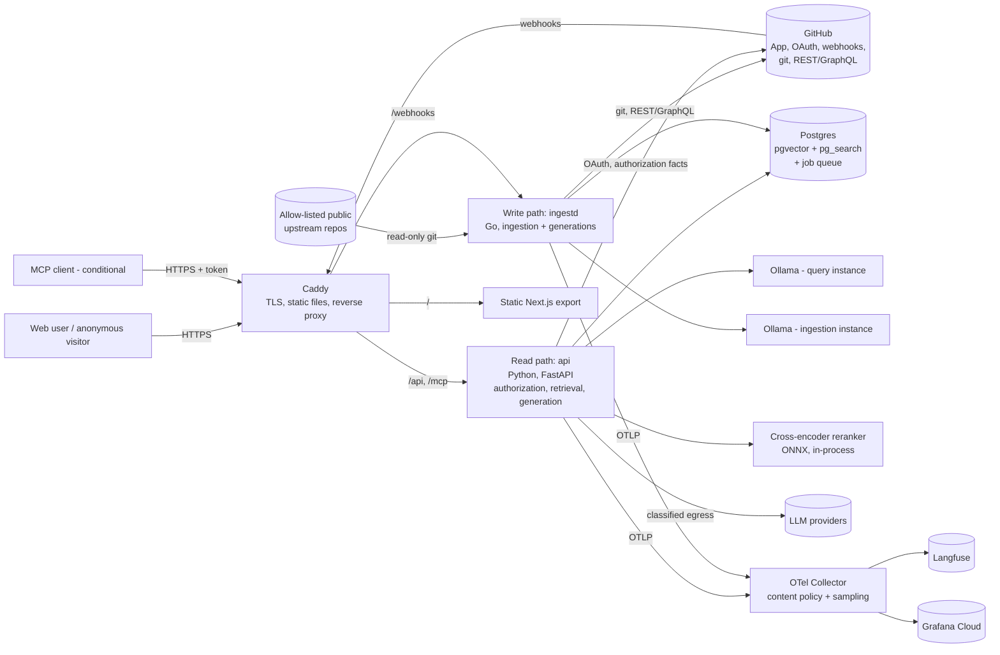

# Wayfinder — Design Document

**Permission-aware retrieval and question answering over a GitHub organization's code, docs, issues and pull requests**

| Field | Value |
|---|---|
| Author / owner | Myan Gupta |
| Approver | Engineering Manager (reviewer of this document) |
| Status | **Draft — for design review (v0.3, responds to the principal review of 2026-09-18)** |
| Version | 0.3 |
| Date | 2026-09-18 |
| Supersedes | v0.2 (2026-09-17), archived at `docs/archive/DESIGN.v0.2.md`, SHA-256 `97c5886374e1488e6c8848186b1323d0ad599222b796c1fcd39fe0b4277f05e3` |
| Review being answered | `docs/review/REVIEW-v0.2.md` (findings WF-01 … WF-30); disposition of every finding in §23 |
| Planned build window | Mon 2026-09-21 → Wed 2026-11-18 (8 weeks + 3 days, §19.8 step 4 taken at G0), launch review Thu 2026-11-19 |
| Working name | "Wayfinder" is a placeholder; rename before the repo goes public |

> **What changed in v0.3.** The v0.2 review found four design-level disclosure paths, a data-identity
> bug that silently keeps the wrong embedding, a job-scheduling contract that does not match the
> library, an evidence gate that is mathematically uninformative, an evaluation oracle that scores a
> correct system as wrong, and a corpus plan that cannot be installed on repositories the author does
> not control. All of those are fixed here rather than deferred. The schedule is rebuilt around a
> safety-and-consistency kernel that lands before any user interface, and it is longer: 250 planned
> hours plus 30 hours of contingency over 8 weeks, not 120 hours over 4. Scope is not reduced to make
> the date; the date moved. §23 maps every finding to the section that answers it.

---

## Table of contents

1. Executive summary
2. Problem statement
3. Goals, non-goals and success metrics
4. Stakeholders and RACI
5. Personas and user stories
6. Requirements
7. Assumptions, dependencies and open questions
8. Architecture overview
9. Detailed design
10. Concurrency and capacity plan
11. Cost analysis
12. Technology stack and decision records
13. Security, privacy and threat model
14. Data, corpus and source acquisition
15. Evaluation methodology and experiments
16. Testing, QA and continuous verification
17. Observability and operations
18. CI/CD, environments and engineering conventions
19. Delivery plan
20. Risk register
21. Alternatives considered
22. Approval checklist
23. Review traceability (WF-01 … WF-30)
- Appendix A — Glossary
- Appendix B — External facts and verification ledger
- Appendix C — Repository layout

---

## 1. Executive summary

Engineers lose time finding *where* something is implemented and *why* it behaves the way it does.
The answers live in code, documentation and project history, spread across repositories, and search
tools either ignore who is allowed to see what or return keyword matches with no explanation.

Wayfinder indexes a GitHub organization and answers two kinds of question:

- **Locate** — "Where is retry backoff configured?" → ranked files and symbols with line-level links,
  pinned to the indexed commit SHA.
- **Explain** — "Why does the client drop the connection after a 401?" → a streamed answer whose
  citations resolve to passages the asker is authorized to see, or an explicit refusal when the
  evidence is insufficient.

**What v1 covers, stated narrowly:** default-branch **code and Markdown** for Python and Go, from two
source modes (repositories where the GitHub App is installed, and allow-listed public upstream
repositories read read-only). Historical rationale is answered only when it exists in indexed
documentation. Issue and pull-request threads are **not** in v1 (§9.13 defines the typed-citation
contract they would need, and §23/WF-21 records why they are out).

Three properties drive the design, and each is a mechanism rather than an intention:

1. **Authorization is a lease, not a lookup.** Every repository fact that permits disclosure — the
   installation is active, the repository is still selected, its visibility is public, this user holds
   a grant — carries an expiry. A negative event (privatisation, removal, suspension, revocation) is
   applied inside the webhook transaction, before any asynchronous refresh. Anything whose authority
   has expired is denied, including public repositories, cached answers, stored traces and in-flight
   streams (§9.1).
2. **Derived data is identified by what produced it.** A chunk's searchable representation is keyed by
   the repository, the embedding specification (model digest, template, pooling, dimension) and the
   hash of the exact embedded input, so re-indexing with a different model can never reuse the old
   vector. Index generations activate under a fencing lease and a desired-generation check, so a slow
   worker cannot roll the index backwards (§9.2–9.4).
3. **Every quality claim is measured against an oracle that could actually be achieved.** Filtered
   vector search is compared with exact search over the *authorized* rows, not the global corpus.
   Locate quality is measured against mined issue→fix labels at each pair's own pre-fix commit.
   Generation is gated on a relevance signal, never on rank-fusion scores, which carry no relevance
   information (§15).

The system targets **1,000 concurrent users** as defined in §10.2 and measured per outcome in §16.4, on **$0 of fixed infrastructure**
(one Oracle Cloud Always Free Arm VM) with **≤ $25/month** of variable spend for evaluation runs,
private-repository demonstrations and live-model safety canaries. Capacity is stated as a hypothesis
until spike S2 and the whole-system load profiles in §16.4 confirm it; the design says what it will do
if the measurement fails (§10.6).

Known limitations are collected in `docs/limitations.md` and summarized where they arise: generated
answers are the capacity-limited mode, a GitHub outage longer than the authority lease returns empty
results rather than stale ones, and small evaluation sets are reported with intervals rather than as
guarantees.

Stack in one line: a Go write path (webhooks, ingestion, generation builds) and a Python read path
(authorization, retrieval, generation) over one Postgres (pgvector + ParadeDB `pg_search`), a static
Next.js client on the same origin, Terraform-provisioned, with OpenTelemetry traces to Langfuse under
a content-capture policy that never exports private material.

---

## 2. Problem statement

### 2.1 The user problem

A developer joining a team, or a forward-deployed engineer working inside a customer's codebase,
spends a large share of early time on questions like: which file handles X, which function do I
change, has this been reported before, why was it built this way. Each of those is answerable from
material the organization already has, and each is slow because the material is scattered and access
rules differ per repository.

### 2.2 The engineering problem

The interesting parts are not "call a model with some context":

1. **Retrieval quality on code**, where identifiers demand exact matching and intent demands semantic
   matching, and neither alone suffices.
2. **Filtered approximate search**, where per-user permission filters remove most rows and quietly
   destroy recall unless the index is scanned differently.
3. **Consistency** between a moving source of truth (git) and a derived index, under concurrent
   webhooks, retries, force-pushes and partial failures.
4. **Authorization that expires**, because the facts permitting disclosure are themselves observations
   of a remote system that can change without telling you.
5. **Honest evaluation** without a hand-labelled dataset of thousands of questions.
6. **Serving 1,000 concurrent users on two CPU cores**, which forces explicit decisions about which
   model runs where and what is shed under load.

### 2.3 Comparison, stated only where it is observed

v0.2 made broad claims about whole product categories. This version claims only what it will
measure: against the chosen baseline of **GitHub code search plus a dense-only retriever over the same
corpus**, Wayfinder reports file-level locate metrics, per-mode answer quality and per-user
authorization correctness. Claims about other products are out of scope.

> **Scope honesty.** This is a portfolio project built by one engineer. Customers and personas are
> simulated. The GitHub App, the authorization model, the evaluation and the deployment are real.
> Sign-off in §22 is self-review unless a named external reviewer is recorded there.

---

## 3. Goals, non-goals and success metrics

### 3.1 Goals

| ID | Goal |
|---|---|
| G-1 | Answer locate and explain questions over code and Markdown with citations pinned to commit SHAs |
| G-2 | Enforce repository-level authorization on every disclosure path, with expiry and fail-closed behaviour |
| G-3 | Keep the index fresh through webhooks, with fenced, atomic per-repository generation switches |
| G-4 | Choose every retrieval component by measured ablation against an achievable oracle, and block regressions in CI |
| G-5 | Serve 1,000 concurrent users (as defined in §10.2) within stated per-outcome SLOs |
| G-6 | Run at $0 fixed infrastructure cost and ≤ $25/month variable cost, with account-level evidence |
| G-7 | Onboard a new organization by installing a GitHub App plus a configuration file, with no code changes |
| G-8 | Produce release evidence — manifests, test reports, load and recovery drills — for the exact shipped commit |

### 3.2 Non-goals

- Issue and pull-request thread retrieval (deferred; contract sketched in §9.13).
- Sources other than GitHub.
- Any write to GitHub.
- Permissions finer than repository level.
- Multi-region deployment or availability above 99.0%.
- Self-hosted generation on the server (CPU-only hardware makes it impractical).
- Kubernetes, microservices, or a dedicated vector database.

### 3.3 Success metrics

Measured on the exact release candidate, with denominators defined in §17.2.

| Metric | Target | Measured by |
|---|---|---|
| Authorization leakage | **0** disclosures outside the authorized set across every deterministic suite and load run; no statistical waiver | Authorization suite (§16.3), independent oracle, load-run invariant |
| Delivered-event revocation | ≤ 5 s from webhook receipt to denial enforcement (synchronous invalidation) | AUTH-02a/02b and AUTH-05 (§16.3), measured end to end |
| Lost-event revocation | ≤ 10 min, bounded by the authority lease, for public visibility, grants and installation state | AUTH-03/AUTH-04 (§16.3) |
| Locate quality | Hybrid + rerank beats **both** BM25-only and dense-only on file-level Recall@10, paired-bootstrap 95% CI of each difference excluding zero | Final held-out split (§14.2) |
| Filtered ANN fidelity | ≥ 0.95 neighbour overlap with exact search over the **authorized** rows at 1%, 10%, 100% visibility | Experiment E7 |
| Answer support | Point estimate ≥ 0.90 **and** the Wilson 95% lower bound ≥ 0.70 on the held-out explain set; the release reports the interval, never the point estimate alone (at n = 20, 18/20 spans 0.699–0.972) | Generation eval (§15.3) |
| Refusal behaviour | Risk-coverage curve published per mode; no generated answers in any mode without a relevance signal | Answerability eval (§15.3) |
| Concurrency — locate and extractive | 1,000 concurrent users meet §10 per-outcome SLOs in both closed-session and open-arrival profiles, with cold and warm cache states reported separately | k6 L1/L1-open (§16.4) |
| Concurrency — generated answers | Published as a **measured** number, not assumed to be 1,000: §10.3 shows generated answers are the capacity-limited mode | k6 L1 with the selected rerank configuration (§16.4) |
| Freshness | Push → searchable p95 ≤ 5 min; missed-event repair ≤ 6 h; both reported separately | Synthetic probe (§17.3) |
| Recovery | Control plane ≤ 1 h, minimal usable search ≤ 4 h, full corpus ≤ 24 h, each verified by a drill with a known query | Restore drill (§17.5) |
| Cost | $0 fixed; variable ≤ $25, with a recorded account quota ledger | Provider consoles, spend limits, Terraform policy check |
| Reproducibility | A release manifest reproduces every reported number within a stated tolerance | Manifest replay (§16.9) |

---

## 4. Stakeholders and RACI

### 4.1 Stakeholders

| Stakeholder | Interest | What they need |
|---|---|---|
| Engineering Manager (approver) | Scope, risk, schedule, cost, quality bar | This document, phase gate reports, the protected release checklist |
| Myan Gupta (author, tech lead, sole implementer) | Delivery; learning retrieval systems in depth | Approved scope, phase order, and the protected-evidence rule |
| Principal reviewer (v0.2 review) | Whether the findings are actually closed | §23 traceability and the five artifacts listed in §19.9 |
| Developer / new-hire / FDE / admin personas (simulated) | Find code, understand behaviour, debug answers, control access | Locate results, cited explanations, retrieval traces, install and revoke flows |
| Anonymous visitor | Try the public demo | A public-data-only contract, stated on the page |
| Security reviewer (named in §22 or marked absent) | No disclosure paths, no secret exposure | Threat model (§13), AUTH/EGRESS suite results |
| Hiring panels (real audience) | Evidence of engineering judgement | README with ADRs, measured results, a 3-minute demo |
| GitHub, Oracle Cloud, LLM providers | Terms of service, quotas, installation rules | Compliance recorded in the dependency ledger (Appendix B) |

### 4.2 RACI

| Activity | Author | Manager | Security reviewer |
|---|---|---|---|
| Requirements and scope | R/A | C (approves) | I |
| Architecture and ADRs | R/A | C | C |
| Authorization model | R | C | A |
| Evaluation methodology | R/A | C | I |
| Threat model | R | I | A |
| Build, tests, evidence | R/A | I | I |
| Phase gate reports | R | A | I |
| Launch decision | R | A | C |

If no external security reviewer is available, §22 records "self-review" explicitly rather than
implying an organizational sign-off.

---

## 5. Personas and user stories

Priorities use MoSCoW. Acceptance criteria are Given/When/Then and map to the test IDs in §16.

| ID | Pri | Story | Acceptance criteria |
|---|---|---|---|
| US-01 | M | As a Dev, I want to ask where behaviour X is implemented. | Given an indexed repository, when I submit a locate query, then I receive ≤ 20 ranked authorized results (file, symbol, line range, snippet) with links at the indexed SHA, ordered deterministically, within the §10 search SLO. |
| US-02 | M | As a New hire, I want an explanation I can verify. | When I submit an explain query, then the answer streams; every citation marker resolves to a passage retrieved and authorized for this request; the final `done` event carries the canonical answer text, its validation status and the share of sentences without a marker. |
| US-03 | M | As any user, I want a refusal instead of a guess. | Given the relevance signal is below the calibrated threshold, or unavailable, when I ask, then I receive either a refusal or an extractive answer of authorized passages, and no generated factual claims. |
| US-04 | M | As an Admin, I want private repositories visible only to people GitHub allows. | Given user U has no read access to repo R, when U runs any query, replays a cached answer, opens a trace, or expands a source, then no content, path, title or metadata from R appears. |
| US-05 | M | As an Admin, I want revocation to take effect on a stated bound. | Given access is removed and GitHub delivers the event, then disclosure stops within 5 s of receipt. Given the event is lost, then disclosure stops within the 10-minute authority lease, including for public→private changes with no commit. |
| US-06 | M | As an Admin, I want to onboard without code changes. | Given a GitHub App installation and an org configuration, when I install and select repositories, then those repositories are queued, indexed and shown with status, indexed SHA and any skipped-material manifest. |
| US-07 | M | As a Dev, I want pushes reflected quickly. | Given a push to the default branch, then new content is searchable within 5 min (p95) and results cite the new SHA, including when the push lands while a build is already running. |
| US-08 | M | As an Admin, I want deletion to mean something specific. | Given a file is deleted, a repository removed, or the app uninstalled, then affected content stops being served immediately, is removed from active stores within 24 h, and cannot be resurrected by a backup restore. |
| US-09 | S | As an FDE, I want a retrieval trace for my own answer. | When I open my trace, then I see per-stage candidates and scores, counts (never content) removed by the authorization filter, degradation flags, provider and model, and a latency breakdown — and only while I still have access to the underlying sources. |
| US-10 | S | As a Dev, I want to rate answers. | When I submit a rating with an optional reason, then it is stored against my own answer with the retrieval and policy manifest, under the same classification policy as the original request. |
| US-11 | C | As a Dev, I want Wayfinder in my coding assistant. | Given an API token, when an MCP client calls `search_code` or `ask`, then results match the web client exactly, and tokens can be listed, scoped and revoked. |
| US-12 | M | As an operator, I want outages to degrade, not fail. | Given a provider, reranker or embedding outage, then the declared mode changes, the response says so, no 5xx is returned for that cause, and generated answers stop wherever the relevance signal is unavailable. |
| US-13 | M | As an engineer on the project, I want regressions blocked. | When a PR changes code, SQL, prompts, templates, policy, fixtures, dependencies or migrations, then the required suites for that change class run, and a security or contract violation blocks merge with no statistical waiver. |
| US-14 | M | As any user at peak load, I want search to keep working. | Given 1,000 concurrent users in either workload model, then search meets its SLO and asks either meet theirs or degrade to a declared mode; rejections are counted and reported separately from errors. |
| US-15 | M | As an anonymous visitor, I want the demo to be honest about data. | Given I am not signed in, then I search only verified-public repositories, the page states a public-data-only input contract, and my session has an opaque principal that owns its own answers and traces. |
| US-16 | M | As the operator of the public corpus, I want a lawful acquisition path. | Given an upstream repository I do not control, then it is ingested through the read-only public connector under its license, with attribution, and never requires an App installation on someone else's organization. |

---

## 6. Requirements

### 6.1 Functional requirements

| ID | Requirement | Stories |
|---|---|---|
| FR-01 | Ingest default-branch code and Markdown through two source modes: installed repositories (GitHub App) and allow-listed public upstream repositories (read-only connector) | US-06, US-16 |
| FR-02 | Chunk code by syntax tree for Python and Go, and Markdown by heading, with defined coverage, oversized-node fallback, and a skipped-material manifest | US-01, US-02 |
| FR-03 | Maintain one active generation per repository, built beside the old one, activated atomically under a build lease and the current desired generation | US-07, US-08 |
| FR-04 | Apply pushes incrementally; handle deletes, force-pushes and missing shallow history by bounded re-snapshot | US-07, US-08 |
| FR-05 | Reconcile source heads every 6 h and repository/installation authorization facts every 5 min; report both lags separately | US-05, US-07 |
| FR-06 | Hybrid retrieval: BM25 + dense with deterministic ordering, RRF fusion, per-file candidate caps, cross-specification fusion, optional cross-encoder rerank | US-01 |
| FR-07 | Evaluate one authorization predicate (§9.1) inside the retrieval query, and re-evaluate it for cache replay, artifact reads, source expansion and long streams | US-04, US-05, US-09 |
| FR-08 | Stream explain answers over SSE with a defined answer state machine, provisional tokens, a canonical terminal event, and citation markers validated against the authorized retrieved set | US-02, US-12 |
| FR-09 | Decide answerability from a versioned relevance signal; where that signal is unavailable, return refusal or extractive output, never a generated answer | US-03, US-12 |
| FR-10 | Authenticate via GitHub OAuth (PKCE); issue opaque principals to anonymous visitors; support logout propagation across workers within a stated bound | US-10, US-15 |
| FR-11 | Apply negative authorization events synchronously in the receiving transaction; refresh grants with revision fencing, single-flight and all-or-nothing pagination | US-05 |
| FR-12 | Classify the complete request envelope — question, rewrites, passages, derived artifacts — and route egress by the intersection of contributing installation policies | US-04 |
| FR-13 | Cache only terminal, eligible answers under a canonical key covering request, scope, versions, policy revisions and classification; re-authorize on every hit; create a per-principal answer record for each hit | US-04, US-14 |
| FR-14 | Record a retrieval trace per request, readable only by its principal and only while the underlying sources remain authorized | US-09 |
| FR-15 | Store feedback against the principal's own answer under the same classification policy | US-10 |
| FR-16 | *(Conditional — ships only if promoted from stretch, §19.8)* Expose `search_code` and `ask` over MCP with full token lifecycle (create, list, scope, expire, revoke) | US-11 |
| FR-17 | Enforce per-principal, per-IP and global admission limits with a documented test-traffic policy | US-14 |
| FR-18 | Provide the evaluation harness: dataset builders with a historical protocol, an authorized exact oracle, metrics with intervals, experiment runner, release manifests and CI gates | US-13 |
| FR-19 | Bound ingestion of untrusted repositories: size, file, parser and storage limits; no execution of repository-supplied code; credential hygiene | US-06 |
| FR-20 | Provide administrative operations (reindex, installation management) behind explicit platform-operator or installation-administrator authority | US-06 |

### 6.2 Non-functional requirements

| ID | Category | Requirement |
|---|---|---|
| NFR-01 | Concurrency | 1,000 concurrent sessions under both §10.2 workload models, < 0.1% server errors; admission rejections reported separately and ≤ 1% at nominal load |
| NFR-02 | Latency — search | p95 ≤ 500 ms, p99 ≤ 1.2 s at the server edge, held absolutely during re-index (not only as a relative degradation bound) |
| NFR-03 | Latency — ask | Generated answers: time to first `token` event p95 ≤ 2.0 s with the stub, reported as total and per stage with the upstream component named. Refusal and extractive answers: time to terminal response p95 ≤ 1.5 s |
| NFR-04 | Freshness | Push → searchable p95 ≤ 5 min; missed-event repair ≤ 6 h; freshness measured as desired-head lag, not time since last commit |
| NFR-05 | Authorization | Delivered-event denial ≤ 5 s; lease-bounded denial ≤ 10 min; applies to search, caches, artifacts, source expansion, provider prompts and in-flight streams |
| NFR-06 | Leakage | Zero disclosures outside the authorized set; hard invariant, no statistical waiver |
| NFR-07 | Availability and recovery | 99.0% monthly on eligible user requests; RTO: control plane ≤ 1 h, minimal usable search ≤ 4 h, full corpus ≤ 24 h; RPO ≤ 24 h for durable records; index rebuildable while sources remain accessible |
| NFR-08 | Cost | $0 fixed; ≤ $25/month variable; infrastructure policy check rejects non-allow-listed resources; provider spend caps configured at the provider |
| NFR-09 | Security | Webhook signature verification, encrypted token storage with rotation, parameterized SQL, bounded untrusted ingestion, least-privilege deploy and database roles, no production secrets for untrusted PR code |
| NFR-10 | Privacy | Classification applies to the whole request envelope and all derivatives; private content never reaches a provider or telemetry destination not approved for it |
| NFR-11 | Maintainability | ≥ 80% line coverage in core packages, ≥ 95% branch coverage in authorization; invariant tests, not coverage, are the quality bar; every significant decision has an ADR |
| NFR-12 | Reproducibility | A release manifest pins code, schema, extensions, grammars, embedding specification, prompts, provider model IDs, datasets and platform; reported numbers reproduce within a stated tolerance |
| NFR-13 | Portability | Pinned native dependencies exercised on each claimed platform (arm64 production, amd64 CI, macOS development) |
| NFR-14 | Accessibility | Keyboard navigation, visible focus, live-region streaming updates, WCAG 2.2 AA contrast checked in CI; full conformance is not claimed |
| NFR-15 | Observability | Unsampled counters and audit events for every request and denial; sampled detailed traces; content capture disabled by default and never for private scope |

### 6.3 Constraints

| Constraint | Value | Consequence |
|---|---|---|
| Team | One engineer | Few moving parts; one datastore; one VM |
| Time | 8 weeks at ~35 h/week (assumption A-1); overtime available, quality protected | Phase gates, not date-driven cuts |
| Money | $0 fixed, ≤ $25/month variable | Free tiers, with account evidence; paid model calls for evaluation, private demos and safety canaries |
| Server | Oracle Always Free Arm: 2 OCPU / 12 GB baseline | CPU is the binding constraint; drives model sizes and rerank policy |
| Development machine | MacBook Pro M2 Pro, 16 GB | Bulk embedding and local batch jobs; not a server |
| GitHub terms | One free personal account plus one machine account; app installation requires authority over the target organization | Multi-user tests use a fixture provider; public upstream corpus uses the read-only connector |
| License | ParadeDB `pg_search` is AGPL-3.0; corpus repositories carry their own licenses | Project is open-source; per-file attribution recorded for indexed snippets |

---

## 7. Assumptions, dependencies and open questions

### 7.1 Assumptions

| ID | Assumption | Validated by |
|---|---|---|
| A-1 | Author capacity ~35 h/week for 8 weeks (250 h planned + 30 h contingency) | Manager confirmation; §19 reports planned vs actual weekly |
| A-2 | An Oracle Always Free A1 (2 OCPU/12 GB) and an AMD micro instance can be provisioned in the chosen region | Spike S3 |
| A-3 | Candidate repositories yield ≥ 300 issue→fix pairs that survive the historical protocol in §14.2 | Spike S1 |
| A-4 | Whole-system CPU at nominal load fits two cores with a rerank configuration that meets quality targets | Spike S2 (per-stage process CPU across query lengths, cache states, ACL selectivity, concurrent indexing) |
| A-5 | The ParadeDB image runs on arm64 and `pg_search` honours MVCC snapshot visibility | Spike S3 |
| A-6 | River can express "a push during a build is never lost" with the pinned version | Spike S5 (the design does not depend on queue uniqueness; §9.3.3) |
| A-7 | Free LLM tiers provide usable but unguaranteed capacity; guaranteed public generation capacity is **zero** until measured | Spike S4, provider ledger |
| A-8 | Load testing with a stubbed model is an acceptable way to evidence *system* concurrency, separate from live generation capacity | **Manager decision — Q-1** |

### 7.2 External dependencies

| Dependency | Used for | Failure impact | Mitigation |
|---|---|---|---|
| GitHub (App, OAuth, webhooks, git, REST/GraphQL) | Sources, identity, authorization facts | No new indexing; sign-in fails; facts cannot refresh | Existing index keeps serving until leases expire, then denies; reconciliation repairs missed events; failed deliveries are **not** auto-redelivered, so repair is scheduled, not assumed |
| Oracle Cloud | Hosting, backups | Full outage | Terraform rebuild against measured RTOs; ADR-0007 option B |
| LLM providers | Generation, rewriting, judging | Asks degrade to extractive | Provider chain, policy intersection, extractive fallback |
| Ollama | Embeddings (query and ingestion instances) | Dense retrieval unavailable | Lexical-only mode, declared; generation disabled when the relevance signal is unavailable |
| Langfuse / Grafana Cloud / Sentry | Traces, metrics, errors | Observability gaps | Unsampled local counters continue; bounded exporter queues |

### 7.3 Open questions for the approver

| ID | Question | Recommendation |
|---|---|---|
| Q-1 | Accept stub-based load testing as evidence for NFR-01, separate from live generation capacity? | Yes — §11.3 shows live testing costs ~$232/hour and free quotas cover a fraction of nominal ask load |
| Q-2 | Accept 99.0% availability and the three-tier RTO (1 h / 4 h / 24 h)? | Yes — single node, measured by drill |
| Q-3 | Accept AGPL-3.0 `pg_search` in an open-source project, with built-in FTS as the fallback? | Yes (ADR-0002) |
| Q-4 | Oracle Pay-As-You-Go conversion? Budgets are **soft** limits, so protection comes from a Terraform allow-list, not the budget alert | Convert only if S3 shows capacity pressure; keep 2 OCPU/12 GB as the sizing baseline either way |
| Q-5 | MCP (FR-16) and agentic mode remain conditional stretch? | Yes |
| Q-6 | Variable budget raised from $10 to $25 to fund private-demo asks and live safety canaries? | Yes — §11.4 |
| Q-7 | Is an external security reviewer available, or is §22 recorded as self-review? | Record honestly; the AUTH/EGRESS suites run either way |

---

## 8. Architecture overview

### 8.1 System context



All services run as Docker Compose units on one Oracle Arm VM. **Two Ollama instances** run the same
model file: one serves user queries, one serves ingestion at lower priority, so bulk batches never
queue ahead of a user (WF-30).

### 8.2 Read path, write path, and who owns authorization

- **Write path — `ingestd` (Go).** Verifies and records webhooks, applies negative authorization
  events in the receiving transaction, advances each repository's desired generation, clones and
  parses sources, builds generations, and activates them under a lease. It never decides whether a
  *user* may see something.
- **Read path — `api` (Python).** Owns the authorization predicate, user grant refresh, GitHub user
  tokens, retrieval, generation, streaming and MCP. Retrieval and the evaluation harness share code.
- **Ownership rule (WF-02, WF-30):** authorization *facts about repositories* are written by whichever
  process receives the event; authorization *decisions about principals* are made only in `api`. Grant
  refresh runs in `api` behind a single-flight lock. `ingestd` may enqueue "this user's grants are
  stale", never write grants.

The services share no RPC; they coordinate through Postgres.

### 8.3 Components

| Component | Responsibility | Scaling unit | State |
|---|---|---|---|
| Caddy | TLS, HTTP/2, static files, proxy, body limits, access logs | 1 | Certificates |
| `web` | Next.js static export; query-parameter routes (no dynamic segments) | Served by Caddy | None |
| `api` | Authorization, retrieval, generation, SSE, MCP | Uvicorn workers (one per core) | Stateless |
| `ingestd` | Webhooks, lifecycle events, ingestion, generations, GC | Worker pool | Stateless |
| Postgres (ParadeDB image) | All durable state: content, representations, generations, authorization facts, jobs, answers, traces, audit | 1 | Everything |
| Ollama ×2 | Query and ingestion embeddings | 2 processes | Model weights |
| Reranker | Cross-encoder in `api` under a bounded semaphore | Per worker | Model weights |
| OTel Collector | Sampling, content policy, export | 1 | None |
| LLM stub (load profile) | Deterministic streaming with configurable latency and error modes; runs off-box | 1 | None |

### 8.4 Request flow — explain question

```mermaid
sequenceDiagram
    participant B as Browser
    participant A as api
    participant P as Postgres
    participant O as Ollama (query)
    participant R as Reranker
    participant L as LLM provider
    B->>A: POST /v1/ask (session cookie)
    A->>P: resolve principal; evaluate allowed() over eligible repos (leases checked)
    A->>P: answer-cache lookup (canonical key incl. policy + generation revisions)
    alt cache hit
        A->>P: re-authorize stored evidence manifest; create a new answer row for this principal
        A-->>B: SSE replay (canonical text, citations, manifest)
    else miss
        A->>O: embed query (per embedding specification)
        A->>P: REPEATABLE READ: bind eligible generations + hybrid query + copy bounded evidence
        A->>R: rerank top-N (admission-controlled)
        A->>A: answerability decision (relevance signal, versioned)
        alt signal unavailable or below threshold
            A-->>B: refusal or extractive answer (authorized passages)
        else answerable
            A->>A: classify request envelope; intersect installation egress policies
            A->>L: generate within deadline and reserved budget
            L-->>A: token stream (provisional)
            A-->>B: SSE tokens
            A->>A: validate markers; build canonical answer; terminal event
            A->>P: persist answer, trace, cache entry (terminal states only)
        end
    end
```

### 8.5 Ingestion flow — push webhook

```mermaid
sequenceDiagram
    participant G as GitHub
    participant I as ingestd (HTTP)
    participant P as Postgres
    participant W as ingestd worker
    participant O as Ollama (ingestion)
    G->>I: POST /webhooks/github (push)
    I->>I: verify signature; dedupe delivery ID
    I->>P: TX: record delivery; repository.desired_generation += 1; enqueue IndexRepo{repo}
    I-->>G: 202 Accepted (well inside the 10 s bound)
    P->>W: job
    W->>P: claim desired generation D with a fencing lease
    W->>W: fetch; resolve head; diff active..head (bounded re-snapshot if history is missing)
    W->>W: chunk (tree-sitter); compute content and embedded-input hashes
    W->>P: reuse representations by (repo, spec, input hash); embed only misses
    W->>O: embed misses (batched, low priority)
    W->>P: TX: verify lease + desired_generation == D + base unchanged; activate; retire old
    W->>P: if desired_generation advanced during the build, claim again (no push is lost)
```
---

## 9. Detailed design

### 9.1 Authorization model

This section replaces v0.2 §9.5 and is the first thing to read. Findings WF-01 through WF-04 all
stem from treating authorization as a lookup over facts that were true when they were fetched.

#### 9.1.1 The predicate

Every disclosure — a search result, a citation, a cached replay, a stored trace, a source expansion, a
prompt sent to a provider, a future MCP tool call — is gated by one predicate, evaluated with a
recorded policy revision:

```text
allowed(principal, repo, t) =
      connection_eligible(repo, t)          -- installation/connection active and not suspended
  AND repository_eligible(repo, t)          -- repo selected, not removed, not transferred, not deleted
  AND ( verified_public(repo, t)            -- visibility observed public AND lease unexpired
        OR valid_user_grant(principal, repo, t) )   -- grant present AND lease unexpired
```

Three rules follow, and each closes a v0.2 gap:

1. **`verified_public` is not `visibility = 'public'`.** It is a fact with an observation time and an
   expiry. A repository that flipped to private with no commit, whose webhook was lost, stops being
   disclosed when its visibility lease expires — even though nothing about the index changed (WF-01).
2. **Anonymous principals are subject to the same predicate.** They simply hold no grants (WF-01).
3. **Expiry denies.** If the fact cannot be refreshed, the repository leaves the eligible set. Serving
   stale private authorization is never preferable to serving less (WF-02).

#### 9.1.2 Facts, leases and revisions

| Fact | Source | Lease | Refreshed by |
|---|---|---|---|
| Installation state (`active`/`suspended`/`deleted`) | `installation`, `installation_repositories` webhooks; periodic list | 10 min | Event, or the 5-minute authorization reconciler |
| Repository eligibility (selected, exists, not transferred) | `repository`, `installation_repositories` webhooks; periodic list | 10 min | Same |
| Repository visibility | `repository` webhook (`privatized`/`publicized`); periodic list | 10 min | Same |
| User grant set | GitHub user token → accessible repositories for each installation | 10 min | `api` refresh, single-flight |
| Public-connector repository facts | Unauthenticated read of the upstream repository during the 30-minute poll | 24 h | `ReconcileAuthorization`; a `public_readonly` connection's own state is administrative and leased locally, since there is no installation to observe |
| Policy revision (per installation) | Configuration change | n/a — monotonic counter | Config apply |

Each of `installation`, `repository` and `user_access_state` carries a monotonically increasing
`authorization_revision`. Any negative event increments the relevant revision.

#### 9.1.3 Negative events are synchronous

When `ingestd` accepts a webhook that reduces authorization — repository privatized, repository
removed from the installation, installation suspended or deleted, member or team access removed,
`github_app_authorization` revoked — it does all of this **inside the transaction that records the
delivery**, before returning 202:

```sql
BEGIN;
INSERT INTO webhook_delivery (delivery_id) VALUES ($1);           -- dedupe
UPDATE repository SET serving_state = 'denied',
       authorization_revision = authorization_revision + 1,
       visibility_valid_until = now()                              -- expire the fact immediately
 WHERE id = $2;
-- Always invalidate every grant on the affected repository, whether or not the event names users.
-- The set is bounded by the number of principals holding a grant on one repository.
UPDATE user_access_state u SET authorization_revision = u.authorization_revision + 1,
       valid_until = now()
  FROM user_repo_access a
 WHERE a.repo_id = $2 AND a.principal_id = u.principal_id;
DELETE FROM user_repo_access WHERE repo_id = $2;
INSERT INTO webhook_delivery (delivery_id) VALUES ($1) ON CONFLICT DO NOTHING;
-- River job inserted in the same transaction (repair, never enforcement):
--   RefreshAccess for each affected principal; ReconcileRepository for $2
COMMIT;
```

Two properties matter here. First, the grants themselves are dropped and their leases expired, so a
`team`, `membership` or `organization` event meets the 5-second bound even though GitHub never tells us
which users lost access — every principal who held a grant on that repository must re-earn it through a
successful refresh. Second, the repository is additionally denied until reconciliation confirms it,
which covers privatisation and removal. Denial is cheap and reversible; disclosure is not. GitHub
availability is therefore never on the denial path (WF-02). `ReconcileAuthorization` may return a
repository to `serving_state = 'active'`, but it never recreates a dropped grant: only a fenced
per-principal refresh does that.

#### 9.1.4 Grant refresh: fenced, single-flight, all-or-nothing

```text
rev := SELECT authorization_revision FROM user_access_state WHERE principal_id = p   -- capture
acquire advisory lock (p)                                                       -- single-flight
pages := GitHub list accessible repositories (all pages, outside any DB transaction)
if any page failed: abort; do NOT extend the lease; the old lease keeps expiring
BEGIN
  if (SELECT authorization_revision FROM user_access_state WHERE principal_id = p) <> rev: ROLLBACK
  replace grants; set refreshed_at = now(), valid_until = now() + 10 min
COMMIT
```

This is the fix for the reordering race: a refresh that started before a revocation cannot install its
older observation, because the revocation moved the revision. Partial pagination never counts as a
successful refresh. GitHub refresh-token rotation invalidates the previous pair, so token refresh runs
under the same lock and stores the rotated pair atomically (WF-02).

#### 9.1.5 Enforcement points

1. **Retrieval SQL** applies the predicate on the scanned relations themselves — `eligible_repo` for
   repository facts and a granted-repository array for the principal half — so pgvector's iterative
   scan can keep scanning until enough authorized rows are found. pgvector filters after the index
   scan, which is exactly why underfill is possible and why §9.5 specifies an underfill policy. Both
   halves of the predicate are emitted by one helper, so no call site can express them differently.
2. **Post-retrieval assertion** in `api`: every returned row's repository is in the authorized set.
   This must never fire; `authorization_violation_total` alerts as stop-the-line.
3. **Cache keys** include the policy revision and each in-scope repository's generation and
   authorization revision; a hit is re-authorized before replay (§9.8).
4. **Artifacts** (answers, traces, feedback) store an evidence manifest of what they depend on, using
   **stable identifiers** — `github_repo_id`, commit SHA, chunker version, embedding-specification
   digest and policy revisions — never serial IDs, which a restore can reuse for different content.
   Every read re-evaluates `allowed()` over that manifest; a manifest that no longer resolves to a
   live generation is treated as unauthorized, not as authorized-but-missing (WF-04, and the restore
   case in §17.5).
5. **Long streams** re-check the lease every 15 s and on every provider continuation, and no stream
   may exceed 120 s; a request that began just before expiry cannot disclose indefinitely (WF-04).
6. **Principals**: an anonymous visitor receives an opaque, server-generated principal ID in a cookie.
   Anonymous artifacts belong to that principal, so two visitors can never read each other's traces,
   and `user_id IS NULL` is never treated as "everyone" (WF-04).

**Availability consequence, stated as a limitation.** Fail-closed means a GitHub outage longer than the
grant or fact lease shrinks the eligible set rather than degrading quality: installation-mode
repositories become unavailable, and the service returns empty results instead of stale ones. Public
connector repositories carry a 24-hour fact lease, so the public demo survives short outages. The
`permissions_public_only` mode in §9.12 is the narrower case where *user-token* refresh fails — an
expired or revoked user token, for example — while repository facts remain fresh. Both behaviours are
recorded in `docs/limitations.md`.

**Stated bounds.** Delivered event → denial ≤ 5 s (synchronous). Lost event → denial ≤ 10 min (lease),
or ≤ 24 h for public-connector visibility facts.
Both are measured end to end (§16.3). The 10-minute window is an accepted product trade-off, recorded
in the README, not an implied claim of instant agreement with GitHub.

### 9.2 Data model

Numbered, immutable SQL migrations (`dbmate`). Abridged; types and indexes are finalized in the first
migration of Phase 1.

```sql
-- ─── Sources and tenancy ────────────────────────────────────────────────────
CREATE TABLE connection (                 -- one per installed app OR public-connector source set
  id             bigserial PRIMARY KEY,
  mode           text NOT NULL CHECK (mode IN ('installation','public_readonly')),
  github_installation_id bigint UNIQUE,   -- NULL for public_readonly
  account_login  text NOT NULL,
  state          text NOT NULL CHECK (state IN ('active','suspended','deleted')),
  state_observed_at timestamptz NOT NULL,
  state_valid_until timestamptz NOT NULL,
  egress_policy  jsonb NOT NULL,          -- approved providers and data class
  policy_revision bigint NOT NULL DEFAULT 1,
  config         jsonb NOT NULL
);

CREATE TABLE repository (
  id                bigserial PRIMARY KEY,
  connection_id     bigint NOT NULL REFERENCES connection(id),
  github_repo_id    bigint UNIQUE NOT NULL,
  full_name         text NOT NULL,
  default_branch    text NOT NULL,
  visibility        text NOT NULL CHECK (visibility IN ('public','private','internal')),
  visibility_observed_at timestamptz NOT NULL,
  visibility_valid_until timestamptz NOT NULL,     -- the lease that makes `verified_public` true
  serving_state     text NOT NULL CHECK (serving_state IN ('active','denied','removed')),
  data_class        text NOT NULL CHECK (data_class IN ('public','private')),
  authorization_revision bigint NOT NULL DEFAULT 1,
  desired_generation bigint NOT NULL DEFAULT 0,    -- advanced by every accepted source event
  claim_token       uuid,                          -- worker claim fence (§9.3.3)
  claim_expires_at  timestamptz,
  active_generation_id bigint,
  license_spdx      text,                           -- recorded for corpus attribution
  updated_at        timestamptz NOT NULL DEFAULT now()
);

CREATE VIEW eligible_repo AS                        -- repository-side half of allowed()
  SELECT r.id AS repo_id, r.data_class,
         (r.visibility = 'public' AND r.visibility_valid_until > now()) AS verified_public
    FROM repository r JOIN connection c ON c.id = r.connection_id
   WHERE r.serving_state = 'active'
     AND c.state = 'active' AND c.state_valid_until > now()
     AND r.visibility_valid_until > now();
-- The principal-side half (grants) is a parameter, not part of the view, because it differs per
-- request:  WHERE e.verified_public OR e.repo_id = ANY(:granted_repo_ids)
-- Both halves are generated from one helper so no call site can express them differently.

-- ─── Index generations ──────────────────────────────────────────────────────
CREATE TABLE generation (
  id               bigserial PRIMARY KEY,
  repo_id          bigint NOT NULL REFERENCES repository(id),
  desired_generation bigint NOT NULL,               -- which desired state this build serves
  commit_sha       text NOT NULL,
  spec_id          bigint NOT NULL REFERENCES embedding_spec(id),
  chunker_version  text NOT NULL,
  status           text NOT NULL CHECK (status IN ('building','ready','active','retired','failed')),
  lease_token      uuid,                            -- copy of the claim fence this build was made under
  heartbeat_at     timestamptz,
  base_generation_id bigint REFERENCES generation(id) ON DELETE SET NULL,
  chunk_count      int,
  skipped_manifest jsonb,                           -- material not indexed, with reasons (§9.3.7)
  created_at       timestamptz NOT NULL DEFAULT now(),
  activated_at     timestamptz,
  UNIQUE (repo_id, commit_sha, chunker_version, spec_id, desired_generation),
  UNIQUE (id, repo_id)                              -- lets occurrence bind generation and repo together
);
CREATE UNIQUE INDEX one_active_per_repo ON generation (repo_id) WHERE status = 'active';
ALTER TABLE repository ADD CONSTRAINT repository_active_generation_fk
  FOREIGN KEY (active_generation_id, id) REFERENCES generation (id, repo_id) DEFERRABLE INITIALLY DEFERRED;

-- ─── Content, representation, occurrence: three different identities ────────
CREATE TABLE embedding_spec (            -- what produced a vector; part of its identity
  id             bigserial PRIMARY KEY,
  model_ref      text NOT NULL,          -- e.g. ollama model name
  model_digest   text NOT NULL,          -- immutable artifact digest, not the alias
  runtime        text NOT NULL,          -- runtime + version
  doc_template   text NOT NULL,          -- e.g. "search_document: {header}\n{body}"
  query_template text NOT NULL,          -- e.g. "search_query: {query}"
  pooling        text NOT NULL,
  normalize      boolean NOT NULL,
  dimension      int NOT NULL,
  truncation     text NOT NULL,          -- explicit policy; never rely on a server default
  tokenizer_ref  text NOT NULL,
  UNIQUE (model_digest, runtime, doc_template, query_template, pooling, normalize, dimension, truncation)
);

CREATE TABLE content (                   -- exact source bytes of a chunk, for citation rendering
  content_hash bytea PRIMARY KEY,        -- SHA-256 over exact bytes
  body         text  NOT NULL,
  language     text,
  token_count  int   NOT NULL
);

CREATE TABLE representation (            -- lexical half + identity; vectors live in per-dimension tables
  id            bigserial PRIMARY KEY,
  repo_id       bigint NOT NULL REFERENCES repository(id),
  spec_id       bigint NOT NULL REFERENCES embedding_spec(id),
  input_hash    bytea  NOT NULL,         -- SHA-256 over the exact embedded input (header+body+template)
  content_hash  bytea  NOT NULL REFERENCES content(content_hash),
  header        text   NOT NULL,         -- deterministic context, part of the embedded input
  body_text     text   NOT NULL,         -- denormalized copy of content.body so BM25 has one indexable row
  live          boolean NOT NULL DEFAULT false,
  UNIQUE (repo_id, spec_id, input_hash),
  UNIQUE (id, repo_id)                   -- lets occurrence bind representation and repo together
);

-- One vector table per embedding dimension, created by migration when a dimension first appears.
-- pgvector needs a typmod dimension to build an HNSW index, so a dimension-less column cannot work.
CREATE TABLE vector_d768 (
  representation_id bigint PRIMARY KEY REFERENCES representation(id) ON DELETE CASCADE,
  repo_id  bigint NOT NULL,              -- denormalized so the filter sits on the scanned relation
  spec_id  bigint NOT NULL,
  live     boolean NOT NULL DEFAULT false,
  embedding halfvec(768) NOT NULL
);

CREATE TABLE occurrence (                -- where a representation appears in one generation
  repo_id       bigint NOT NULL REFERENCES repository(id),
  generation_id bigint NOT NULL,
  representation_id bigint NOT NULL,
  FOREIGN KEY (generation_id, repo_id) REFERENCES generation (id, repo_id) ON DELETE RESTRICT,
  FOREIGN KEY (representation_id, repo_id) REFERENCES representation (id, repo_id) ON DELETE RESTRICT,
  -- the composite keys make a cross-repository binding unrepresentable
  path          text NOT NULL,
  blob_sha      text NOT NULL,
  start_line    int  NOT NULL,
  end_line      int  NOT NULL,
  symbol        text,
  PRIMARY KEY (generation_id, representation_id, path, start_line)
);

CREATE TABLE embedding_cache (           -- compute reuse only; never a serving path
  input_hash bytea NOT NULL,
  spec_id    bigint NOT NULL REFERENCES embedding_spec(id),
  embedding  halfvec NOT NULL,
  data_class text NOT NULL,              -- private entries are deletable; see 9.3.6
  PRIMARY KEY (input_hash, spec_id)
);

CREATE TABLE tombstone (                 -- survives restore; replayed before serving
  id           bigserial PRIMARY KEY,
  scope        text NOT NULL CHECK (scope IN ('repository','representation','connection')),
  ref          text NOT NULL,
  created_at   timestamptz NOT NULL DEFAULT now(),
  expires_at   timestamptz NOT NULL      -- retained ≥ 90 days
);

-- ─── Principals and authorization ───────────────────────────────────────────
CREATE TABLE principal (
  id             bigserial PRIMARY KEY,
  kind           text NOT NULL CHECK (kind IN ('user','anonymous')),
  github_user_id bigint UNIQUE,          -- NULL for anonymous
  login          text,
  token_ciphertext   bytea,              -- AES-256-GCM; key outside the database
  token_expires_at   timestamptz,        -- GitHub user tokens: 8 h
  refresh_ciphertext bytea,              -- refresh token; rotation invalidates the old pair
  refresh_expires_at timestamptz
);
CREATE TABLE session (
  id_hash    bytea PRIMARY KEY,
  principal_id bigint NOT NULL REFERENCES principal(id),
  revoked_at timestamptz,
  expires_at timestamptz NOT NULL
);
CREATE TABLE user_repo_access (
  principal_id bigint NOT NULL REFERENCES principal(id),
  repo_id      bigint NOT NULL REFERENCES repository(id),
  PRIMARY KEY (principal_id, repo_id)
);
CREATE TABLE user_access_state (
  principal_id bigint PRIMARY KEY REFERENCES principal(id),
  authorization_revision bigint NOT NULL DEFAULT 1,
  refreshed_at timestamptz NOT NULL,
  valid_until  timestamptz NOT NULL
);

-- ─── Serving artifacts ──────────────────────────────────────────────────────
CREATE TABLE answer (
  id               uuid PRIMARY KEY,
  principal_id     bigint NOT NULL REFERENCES principal(id),   -- never NULL; anonymous has a principal
  status           text NOT NULL CHECK (status IN
                     ('pending','streaming','completed','refused','extractive','failed','cancelled')),
  mode             text NOT NULL CHECK (mode IN ('locate','generated','refused','extractive')),
  query            text NOT NULL,
  canonical_text   text,
  citations        jsonb,                -- marker → representation id, repo, path, lines, sha, url
  evidence_manifest jsonb NOT NULL,      -- STABLE identifiers: github_repo_id, commit_sha,
                                         -- chunker_version, embedding-spec digest, policy revisions
                                         -- (never bigserial ids, which a restore can reuse)
  classification   text NOT NULL,        -- data class of the whole request envelope
  pipeline_config  text NOT NULL,
  degraded         text[] NOT NULL DEFAULT '{}',
  provider         text, model text, usage jsonb,
  terminal_reason  text,
  cached_from      uuid REFERENCES answer(id) ON DELETE SET NULL,
  idempotency_key  bytea,
  created_at       timestamptz NOT NULL DEFAULT now(),
  UNIQUE (principal_id, idempotency_key)
);
CREATE TABLE answer_trace (answer_id uuid PRIMARY KEY REFERENCES answer(id) ON DELETE CASCADE,
                           trace jsonb NOT NULL);
CREATE TABLE answer_cache (cache_key bytea PRIMARY KEY, answer_id uuid NOT NULL REFERENCES answer(id),
                           expires_at timestamptz NOT NULL);
CREATE TABLE feedback (answer_id uuid REFERENCES answer(id) ON DELETE CASCADE,
                       principal_id bigint NOT NULL REFERENCES principal(id),
                       rating smallint, reason text, created_at timestamptz NOT NULL DEFAULT now());
CREATE TABLE audit_event (id bigserial PRIMARY KEY, kind text NOT NULL, subject text,
                          detail jsonb NOT NULL, created_at timestamptz NOT NULL DEFAULT now());
CREATE TABLE webhook_delivery (delivery_id uuid PRIMARY KEY,
                               received_at timestamptz NOT NULL DEFAULT now());

-- Privileged authority (WF-23): platform operators are global; installation administrators are scoped.
ALTER TABLE principal ADD COLUMN platform_role text NOT NULL DEFAULT 'user'
  CHECK (platform_role IN ('user','operator'));
CREATE TABLE connection_admin (connection_id bigint NOT NULL REFERENCES connection(id),
                               principal_id  bigint NOT NULL REFERENCES principal(id),
                               PRIMARY KEY (connection_id, principal_id));
```

**Indexes that matter** (one HNSW index per embedding specification, since dimensions differ):

```sql
-- One HNSW index per dimension table, partial on `live` only. `spec_id` is an ordinary predicate in
-- the query rather than part of the index predicate, so adding a specification needs no new migration
-- and no literal-matching assumption about partial-index proofs.
CREATE INDEX vec768_hnsw ON vector_d768 USING hnsw (embedding halfvec_cosine_ops) WHERE live;
CREATE INDEX vec768_repo ON vector_d768 (repo_id, spec_id) WHERE live;
CREATE INDEX rep_bm25 ON representation USING bm25 (id, header, body_text, repo_id, live)
  WITH (key_field = 'id');                      -- exact DDL per the pinned pg_search version
CREATE INDEX rep_repo_live ON representation (repo_id) WHERE live;
```

`live` is therefore maintained in two places (the representation row and its vector row) inside the
same activation transaction, and `body_text` duplicates `content.body`. Both costs are accepted
deliberately: BM25 needs one indexable row, and the vector index needs a fixed dimension. The plan
capture in §9.5 includes an `EXPLAIN` case proving the partial index is chosen with a parameterized
`spec_id`.

**Why three identities (WF-05).** `content` is the exact source text. `representation` is what a
particular embedding specification produced from a particular input (header + body + template).
`occurrence` is where that text sits in a generation. v0.2 collapsed all three into one row keyed by
`(repo_id, content_hash)`, so re-indexing with a second model hit `ON CONFLICT DO NOTHING` and kept the
first model's vector — the reviewer reproduced exactly that. With `(repo_id, spec_id, input_hash)`, a
new specification produces new rows; the old ones keep serving until their generation retires.

**Model transitions.** Two specifications may be live at once. Retrieval resolves the specification per
repository generation, runs one dense subquery per specification, and fuses ranks with RRF — ranks are
comparable across vector spaces even when distances are not. A specification is retired only when no
active generation references it. A global query-embedder swap while other repositories still use the
old space is forbidden by construction.

### 9.3 Ingestion, generations and deletion

#### 9.3.1 Two source modes (WF-20)

| Mode | Used for | Authorization | Change detection |
|---|---|---|---|
| `installation` | Repositories in organizations the author controls, including mirrors | GitHub App installation, webhooks, user grants | Webhooks + 6 h head reconciliation |
| `public_readonly` | Allow-listed public upstream repositories (the evaluation corpus) | None required beyond the repository's license; read-only git clone and unauthenticated or token-limited REST | Polling every 30 min; no webhooks |

This closes the v0.2 flaw of assuming an App could be installed on `pydantic/pydantic`. Public-mode
repositories are always `data_class = 'public'`, are never used to demonstrate private authorization,
and carry recorded license and attribution metadata. Private-authorization demos use installation-mode
repositories the author owns.

#### 9.3.2 Source contract

```go
type Source interface {
    Resolve(ctx context.Context, repo Repo) (rev string, err error)          // current default-branch head
    Snapshot(ctx context.Context, repo Repo, rev string) (DocumentIter, error)
    Changes(ctx context.Context, repo Repo, fromRev, toRev string) (ChangeSet, error)  // may report ErrHistoryMissing
}
```

`ErrHistoryMissing` (force-push past a shallow boundary, or a rewritten history) triggers a bounded
full re-snapshot rather than a partial diff (WF-19).

#### 9.3.3 Desired generations replace queue uniqueness (WF-07)

v0.2 relied on River skipping duplicate inserts while a job waits. Current River documentation
requires `running` among custom unique states, so that scheme can drop a push that arrives mid-build.
The fix removes the dependency entirely:

- Every accepted source event increments `repository.desired_generation` **in the receiving
  transaction** and enqueues `IndexRepo{repo_id}`. The queue is a wake-up mechanism, not the source of
  truth.
- A worker claims the repository with a lease: `UPDATE repository … SET lease_token, lease_expires_at
  WHERE id = $1 AND (lease_expires_at IS NULL OR lease_expires_at < now())` and reads `D =
  desired_generation`.
- On completion the worker re-reads `desired_generation`. If it advanced, it re-claims immediately
  (or re-enqueues) rather than waiting for reconciliation.
- If the worker dies, the lease expires and the reconciler re-enqueues any repository whose
  `desired_generation` exceeds its active generation's.

Correctness does not depend on which states River deduplicates; spike S5 proves it against the pinned
version by pushing at every boundary (before claim, mid-build, during the final head check, during
activation, during retry) and killing the process at each one.

#### 9.3.4 Jobs

| Job | Trigger | Concurrency | Notes |
|---|---|---|---|
| `IndexRepo{repo}` | Source event, onboarding, reconciliation | Workers = cores, serialized per repository by the lease | Debounce is a 30 s scheduled delay; correctness comes from the generation counter |
| `RefreshAccess{principal}` | Authorization event, lease expiry, token expiry | 4 (I/O-bound), single-flight per principal, executed in `api` | Repair path only; never the enforcement path |
| `ReconcileAuthorization` | Every 5 min | 1 | Re-observes installation state, repository eligibility and visibility; extends or expires leases |
| `ReconcileSources` | Every 6 h | 1 | Compares desired vs active generations and heads |
| `GarbageCollect` | After retirement, delayed 10 min | 1 per repository | Ordered deletion (§9.3.6) |

`ingestd` runs at lower OS priority than `api`, and uses the ingestion Ollama instance, so bulk
embedding never queues ahead of user queries.

#### 9.3.5 Activation is fenced (WF-08)

```sql
BEGIN;
SELECT desired_generation, active_generation_id, claim_token, claim_expires_at
  FROM repository WHERE id = $repo FOR UPDATE;
-- Application aborts unless ALL hold:
--   claim_token = $my_claim AND claim_expires_at > now()       (I still own this repository)
--   desired_generation = $D                                    (my target is still the desired one)
--   active_generation_id IS NOT DISTINCT FROM $base            (nobody activated underneath me)
--   generation.status = 'ready' AND chunk_count verified       (the build is complete)
UPDATE representation SET live = true  WHERE id = ANY($added);
UPDATE representation SET live = false WHERE id = ANY($removed);
UPDATE vector_d768   SET live = true  WHERE representation_id = ANY($added);
UPDATE vector_d768   SET live = false WHERE representation_id = ANY($removed);
UPDATE generation SET status = 'retired' WHERE id = $base;
UPDATE generation SET status = 'active', activated_at = now() WHERE id = $new;
UPDATE repository SET active_generation_id = $new, updated_at = now()
 WHERE id = $repo AND active_generation_id IS NOT DISTINCT FROM $base;   -- 1 row, else ROLLBACK
COMMIT;
```

On conflict the worker does **not** retry its old target; it re-resolves the current desired
generation and rebuilds from there. That prevents the regression the reviewer modelled, where a slow
worker recomputes a diff and then activates stale content. `one_active_per_repo` enforces the
invariant structurally, and the status machine is explicit: `building → ready → active → retired`,
with `building → failed` on lease expiry and `failed → building` only via a new claim.

The `live` flag cannot be a heap-only update (it appears in the partial and BM25 indexes), so each
activation writes new index entries proportional to the diff; `autovacuum_vacuum_scale_factor = 0.02`
on `representation`, and a full re-index is followed by an explicit `VACUUM`. Building a generation's
occurrence set is O(repository), while activation is O(diff) — v0.2 conflated the two (WF-30).

#### 9.3.6 Deletion closure and GC order (WF-06)

Deletion is four distinct guarantees, stated separately in the README:

| Guarantee | Bound | Mechanism |
|---|---|---|
| Stops being served | Immediate (same transaction as the event) | `serving_state = 'denied'`, lease expiry, cache keys invalid |
| Removed from active stores | ≤ 24 h | Ordered GC below |
| Derivatives (answers, traces, feedback, caches) | ≤ 24 h for affected artifacts; 30 days otherwise | Evidence-manifest lookup, then redact or delete |
| Backups | ≤ 14 days | Documented exception; encrypted at rest |

Ordered GC, under the repository lease, with FKs deliberately `RESTRICT` so an out-of-order delete
fails loudly instead of cascading silently:

1. Delete `occurrence` rows of generations in `retired`/`failed` older than the grace period.
2. Delete `code_edge` rows for those generations.
3. Delete `generation` rows with no occurrences. `base_generation_id` is `ON DELETE SET NULL`, so a
   successor generation does not block its predecessor's removal; `answer.cached_from` is likewise
   `ON DELETE SET NULL`, so expiring a cached-from parent does not block on its children.
4. Delete `representation` rows where `live = false` **and** no occurrence references them **and** no
   `building`/`ready`/`active` generation does (the reuse-after-revert case the reviewer raised).
5. Delete `content` rows referenced by no representation.
6. Delete `embedding_cache` rows whose `data_class = 'private'` and whose `input_hash` is referenced
   by no representation. Public cache entries persist, and the README says so.
7. Redact or delete answers, traces and feedback whose evidence manifest references removed sources.
8. Delete the working clone.
9. Write a `tombstone` row (retained ≥ 90 days) so a restore cannot resurrect the data (§17.5).

`content` and `embedding_cache` are shared across repositories, so step 5 and step 6 delete only rows
no remaining representation references. Identical text present in both a deleted private repository and
a live public one keeps its `content` row, because that row is a byte-identical copy of public text; the
limitation is recorded rather than hidden.

#### 9.3.7 Untrusted repositories (WF-19)

Sources are hostile input, not trusted content:

- **Never execute repository-supplied code**: no hooks, no build scripts, no LFS smudge filters, no
  recursive submodule commands, no language tooling invoked "to help parse". `core.hooksPath` is set
  to an empty directory and `GIT_TERMINAL_PROMPT=0`.
- **Bounds**, per repository and per connection: clone bytes, file count, per-file bytes, per-file
  parse time and memory, total corpus size, and wall-clock per build. Exceeding a bound skips the item
  and records it in the skipped-material manifest, which is shown on the repository page.
- **Classes handled explicitly**: binaries, symlinks (never followed outside the work tree), submodules
  (not fetched), vendored and generated paths (excluded by default patterns), unsupported languages,
  malformed syntax, LFS pointers, empty or deleted default branches, paths beginning with `-`,
  newline and Unicode paths, CRLF, and files above the token limit.
- **Credential hygiene**: tokens are supplied through an askpass helper or a header, never embedded in
  a remote URL; git stderr is scrubbed before logging.
- A build that skipped material is never advertised as complete: `generation.status` carries the
  manifest, and the repository page shows it.

### 9.4 Chunking and representation identity

#### 9.4.1 Structural ownership (WF-24)

tree-sitter grammars for Python and Go (TypeScript is a stretch language). The chunker emits:

- one **leaf chunk** per function or method body;
- one **residual chunk** per class or module covering the code *not* inside a leaf (decorators,
  attributes, imports, module-level statements).

Leaves and residuals do not overlap, so the coverage invariant is exact: every accepted source line
belongs to exactly one chunk, and every excluded line appears in the skipped manifest with a reason.
Oversized leaves (> 512 tokens) split at statement boundaries; a single statement that still exceeds
the limit splits at a token boundary with a recorded `split_index`, because "split only at statement
boundaries" is not always satisfiable. Invalid syntax falls back to a line-window chunker, flagged so
retrieval quality can be measured separately for those files.

#### 9.4.2 Normalization is defined, and separate from source (WF-24)

- **Citation text** is the exact source bytes from `content`; nothing is normalized.
- **Embedded input** is `template(header, body)` where the header carries path, symbol, signature and
  docstring. Normalization for embedding is limited to Unicode NFC and trailing-whitespace removal per
  line. Indentation, string literals, case and punctuation are preserved, because they carry meaning in
  code.
- **Queries** are normalized the same way. Whitespace inside quoted strings is never collapsed — the
  reviewer showed `"a  b"` and `"a b"` collapsing to the same text.
- Token counts use the specification's tokenizer, and the combined header + body is budgeted below the
  model's input limit. Truncation is explicit in `embedding_spec.truncation`; relying on the server's
  silent truncation default is forbidden.

#### 9.4.3 Code graph (stretch)

Import, definition and name-based call edges per generation, stored in `code_edge` and traversed with a
recursive CTE. Name-based calls over-link, so edges only add candidates before reranking. Graph
expansion stays disabled unless experiment E8 shows a measured gain in both recall and answer quality,
since extra candidates change the evidence a generated answer sees, not just latency (WF-25).

### 9.5 Retrieval pipeline

```
query → normalize → per-specification embed ─┐
      └─────────→ BM25 top-100 ──────────────┼→ RRF fuse → [graph expand] → [rerank] → top-k
                    dense top-100 per spec ──┘
      (every leg filtered by the eligible_repo predicate AND live)
```

1. **Normalize** (§9.4.2); reject inputs above 2,000 characters before any model call.
2. **Lexical leg**: BM25 over header and body with a code-aware tokenizer — identifiers split on
   camelCase, snake_case and dots while the original token is also indexed; paths indexed as a
   separate field. The lexical query language is escaped; SQL parameterization protects SQL structure,
   not a nested query grammar (WF-25).
3. **Dense leg**: one HNSW search per embedding specification in scope, `hnsw.iterative_scan =
   relaxed_order`. Relaxed results are re-sorted by exact distance before ranks are assigned, so
   ranking is deterministic. Ties break on `(score desc, repo_id, path, start_line)`.
4. **Underfill policy**: if a leg returns fewer than requested rows or exhausts `max_scan_tuples`, the
   trace records it and the response carries `degraded: ["ann_underfill"]`. When the authorized set is
   small (below a measured threshold from E7), the planner uses exact vector search instead — at this
   corpus size that is often both simpler and faster.
5. **Fusion**: RRF across legs and specifications, `k = 60` by default (E2 revisits it).
6. **Per-file candidate cap** (default 3) so one large file cannot crowd out the candidate pool.
7. **Rerank**: cross-encoder over the top N candidates at length L, admission-controlled; if the queue
   wait exceeds 150 ms, the request proceeds without reranking and is flagged — which also disables
   generated answers (§9.6).
8. **Shaping**: locate requests aggregate to files (max score per file, deterministic tie-break) and
   return up to 20; explain requests pass the top 8 passages to the answerability decision.

`EXPLAIN (ANALYZE, BUFFERS)` output for the two-leg query is captured in CI on the pinned extensions;
the existence of an index is not evidence that it is used (WF-25).

### 9.6 Answerability, answer modes and citations

#### 9.6.1 Answerability is a versioned decision, never a fusion score (WF-10)

v0.2 fell back to a calibrated RRF threshold when reranking was shed. That is uninformative: with
k = 60, a document ranked first by both legs always scores 2/61, whether it is the perfect answer or
the least irrelevant document in the corpus. RRF encodes rank agreement, not relevance.

The replacement:

- The **relevance signal** is the cross-encoder score of the best passage, plus the margin to the
  second passage and the number of passages above threshold. It has its own version string, recorded
  in every answer manifest.
- The threshold τ is calibrated on the dev split against a target answer precision, and reported on
  the held-out split with a risk-coverage curve, per mode.
- **If the relevance signal is unavailable** — reranker shed, model down, lexical-only mode — the
  system does not generate. It returns an extractive answer or a refusal. A degraded mode never
  inherits the normal mode's quality numbers.
- Multi-part questions: a high best-passage score does not certify that every part is answerable. The
  answer prompt requires the model to name the parts it cannot support, and those cases are measured
  separately.

#### 9.6.2 Answer modes (WF-09, WF-11)

| Mode | Response contract | Release evidence |
|---|---|---|
| `locate` | Authorized distinct files with exact locations, deterministic ordering | File-level metrics, latency |
| `generated` | Canonical completed text, authorized citations, declared validation status, model and config manifest | Claim support, citation completeness, usefulness, coverage |
| `refused` | No generated factual claims; closest authorized evidence labelled insufficient | Answerable/unanswerable confusion matrix |
| `extractive` | Authorized passages plus an explicit notice that generation was unavailable or not permitted | Citation and source integrity |
| `failed` (after streaming) | Typed terminal error, explicit replacement protocol, partial output never reusable or cacheable | Partial-failure and reconnect tests |
| `rejected` (before work) | 429/503 with `Retry-After`, counted in admission reporting, not in error rate | Admission and rate-limit tests |

State machine: `pending → streaming → {completed, refused, extractive, failed, cancelled}`. Only
`completed`, `refused` and `extractive` are cacheable. A provider may be swapped **before** the first
token; after the first token the stream ends with a typed terminal event and, if a replacement answer
is produced, an explicit reset event — never silent concatenation of two providers' prose. Retries
carry an idempotency key unique per `(principal, request hash)`, and in-flight deduplication prevents
a reconnecting client from paying for a second generation.

#### 9.6.3 Citations: what is guaranteed, and what is measured

Guaranteed by construction: every citation marker in the canonical answer resolves to a passage that
was retrieved for this request and is authorized for this principal at read time.

Measured, not guaranteed: that a cited passage actually supports the claim citing it. v0.2's executive
summary overclaimed this; §1 now states it correctly. Streamed tokens are **provisional**; the `done`
event carries the canonical text, the citation map, the validation status, and the count of sentences
with no marker. Markers are validated after completion, unknown markers are removed, and the answer is
flagged `citation_repair`.

Passage delimiters are escaped in passage text, and instructions state that passages are data. This is
a hardening measure, not a security boundary: a model can emit arbitrary text, so §13 no longer claims
answers "can only contain" retrieved content.

Rendering: Markdown with raw HTML disabled, **remote images disabled**, and links restricted to
server-constructed `github.com` destinations. Blocking anchors alone would leave image loading as a
model-controlled egress channel (WF-03).

### 9.7 Egress classification and the provider layer

#### 9.7.1 Classify the envelope, not the passages (WF-03)

The classification of a request is the maximum sensitivity of **everything that would leave the
process**: the question text, any rewritten query, the retrieved passages, the system prompt, and any
derived artifact (judge inputs, exception payloads, feedback exports, debug logs, telemetry).

- **User-supplied text is classified by the connection's declared input policy, never by what
  retrieval happened to select.** Every installation-mode connection declares `input_class = private`
  by default, so any signed-in request — even one whose passages are entirely public — is
  private-classified. This is the only way to protect a secret pasted into a question, and it is why
  classification cannot be derived from repository scope.
- The **anonymous public demo** is the single public-classified path: `input_class = public`, stated on
  the page as a public-data-only input contract, with no private repository reachable from it.
- An installation may opt into `input_class = public` explicitly; that is a recorded configuration
  decision with the policy revision, not a default.
- Where multiple connections contribute, the approved provider set is the **intersection** of their
  egress policies. An empty intersection means extractive output, never a "best effort" provider.
- Unknown classification is treated as private.

#### 9.7.2 Provider routing, budgets and deadlines (WF-12)

One interface, `Generator.stream(request, policy)`, over official SDKs. Before dispatch the request
reserves, atomically in Postgres: estimated input tokens, maximum output tokens, one request slot, and
an upper-bound cost. Actual usage reconciles the reservation afterwards, and an unreconciled
reservation expires conservatively.

- **Windows**: requests per minute, tokens per minute, daily quota and monthly spend are tracked
  separately per provider and model. At nominal load with 5,000-token prompts the system offers
  ~2.75M input tokens/minute, which is the number that matters against token quotas; RPM alone is not
  a capacity model.
- **Deadlines**: one end-to-end deadline per ask (20 s to terminal), a 3 s budget to first token, and a
  total attempt budget of 3 across all providers. Provider SDK retries are disabled (`max_retries = 0`)
  so retries are counted once, by us.
- **Health**: circuit state, quota state and half-open probe slots live in Postgres so both workers
  agree; at most one half-open probe per provider.
- **Error classes are distinct**: throttling, token-window exhaustion, daily-quota exhaustion, spend
  cap, authorization failure, malformed request, provider outage. Only the first three are retryable
  on another provider.
- **Data terms**: Anthropic's commercial terms (no training on API inputs/outputs by default) make it
  the approved provider for private-classified requests. Free tiers whose terms permit training on
  inputs — Google's unpaid service explicitly does, and advises against submitting confidential data —
  are approved for public-classified requests only. Unverified terms mean not approved.
- **Per-connection budgets** prevent one installation from consuming the entire paid allowance.

### 9.8 Caching

| Cache | Key | Invalidation | Rationale |
|---|---|---|---|
| Answer cache | SHA-256 over a **length-delimited canonical serialization** of: normalized query, endpoint, mode and options, `k`, requested repository filter, the sorted set of in-scope repositories with their active generation IDs and authorization revisions, policy revisions, classification, retrieval config hash, answerability version, generation config hash | 24 h, plus implicit invalidation whenever any component changes | Popular questions cost no model call; a key change is a freshness mechanism, not deletion |
| Query embedding | `(normalized query, spec_id)` | In-process LRU, 10k entries | Saves CPU; excluded in the cold load profile |
| Session | session token hash | 30 s TTL; logout is immediate in the worker that handled it and ≤ 30 s in the other, which is the stated propagation bound. Security-sensitive transitions (revocation, denial) are never served from this cache: the authorization predicate is evaluated per request | Bounded, stated logout propagation (WF-23) |
| Embedding compute cache | `(input_hash, spec_id)` | Deleted for private content when unreferenced (§9.3.6) | Ingestion cost only, never a serving path |

A cache **hit** re-evaluates `allowed()` over the stored evidence manifest, then writes a **new answer
row owned by the requesting principal** with `cached_from` set, so traces and feedback work without
exposing another principal's artifact (WF-04, WF-11). Only terminal eligible states are cached.
Hashing the question does not anonymize it: the plaintext is stored under the same classification
policy as the request.

A semantic cache (similar rather than identical questions) remains out of v1 until experiment E11
measures its false-hit rate.

### 9.9 API surface and the SSE contract

Business endpoints are versioned under `/v1`; authentication, health, webhook and admin routes sit
outside that prefix (WF-30).

| Method | Path | Auth | Purpose |
|---|---|---|---|
| GET | `/healthz` | none | Liveness |
| GET | `/readyz` | none | **Minimum safe serving path only**: database, authorization resolution, lexical retrieval |
| GET | `/capabilities` | none | Optional capability health: dense retrieval, reranker, providers, declared modes |
| GET | `/auth/github/login`, `/auth/github/callback` | none | OAuth with PKCE, single-use state bound to a short-lived browser transaction, validated redirect target |
| POST | `/auth/logout` | session | Revokes the session and bumps the revocation epoch |
| GET | `/v1/me` | optional | Principal, visible repositories, generation status, freshness |
| POST | `/v1/search` | optional | Locate: `{query, repos?, k ≤ 20, rerank?}` |
| POST | `/v1/ask` | optional | Explain: `{query, repos?, strategy: "fast"｜"agentic", idempotency_key?}` → SSE. `agentic` is rejected with 400 unless the stretch mode has shipped (§19.8) |
| GET | `/v1/answers/{id}` | principal + current source authorization | Canonical answer, citations, status |
| GET | `/v1/answers/{id}/trace` | principal + current source authorization | Retrieval trace; 404 for anyone else |
| POST | `/v1/answers/{id}/feedback` | principal | Rating and reason |
| GET/POST/DELETE | `/v1/tokens` | session | Create, list, scope, revoke API tokens (required before MCP ships) |
| POST | `/mcp` | bearer token | Conditional (FR-16) |
| POST | `/webhooks/github` | HMAC | Served by `ingestd` |
| POST | `/admin/reindex/{repo}` | `principal.platform_role = 'operator'`, or a row in `connection_admin` for that repository's connection — checked explicitly per request | Force rebuild |

**SSE events for `/v1/ask`:**

```
event: retrieval  data: {"answer_id":"…","mode":"generated","passages":[…],"degraded":[…]}
event: token      data: {"t":"…"}                       # provisional
event: done       data: {"status":"completed","canonical_text":"…","citations":{…},
                         "validation":"ok|citation_repair","uncited_sentences":2,
                         "evidence_manifest":{…},"provider":"…","usage":{…},"degraded":[…]}
event: reset      data: {"reason":"provider_failed_after_partial","replacement_answer_id":"…"}
event: error      data: {"code":"…","message":"…","retry_after":12}      # terminal
```

Mutating, cookie-authenticated requests require an `Origin` check and a JSON content type; `SameSite=Lax`
alone is not treated as sufficient CSRF defence. A 15 s comment keep-alive holds proxies open, client
disconnects cancel upstream generation, and the retrieval transaction is committed before any provider
call so no database connection is held across model latency (WF-11).

### 9.10 MCP server (conditional, FR-16)

If promoted, MCP exposes `search_code` and `ask` over Streamable HTTP with bearer tokens that carry the
same principal, the same predicate, the same rate limits and the same classification policy. Token
listing, scoping, expiry and revocation ship with it, not after.

### 9.11 Web client

Next.js App Router with `output: 'export'`, served by Caddy on the same origin; routes use query
parameters (`/answer?id=…`), since static export cannot pre-render per-answer pages (WF-30). Tailwind
and shadcn/ui; TanStack Query; a typed client generated from the OpenAPI document. Views: search,
ask (streaming with citation chips), repositories (status, indexed SHA, freshness, skipped-material
manifest), answer/trace, tokens. Accessibility: keyboard navigation, visible focus, `aria-live` for
streamed output, contrast checked by axe in CI.

### 9.12 Degradation: independent capability flags

v0.2 presented L0–L7 as an ordered ladder; they are independent conditions that can occur together
(WF-30). The response carries a `degraded` array and the declared `mode`.

| Flag | Trigger | Effect |
|---|---|---|
| `rerank_shed` | Reranker queue wait > 150 ms or error | Fused order; **generated answers disabled** (§9.6.1) |
| `dense_unavailable` | Ollama query instance down or slow (> 300 ms) | Lexical-only retrieval; generated answers disabled |
| `ann_underfill` | Iterative scan exhausted | Reported; exact fallback where the authorized set is small |
| `generation_unavailable` | All approved providers exhausted or policy-empty | Extractive answer |
| `permissions_public_only` | User-token refresh failed past its lease while repository facts remain fresh | Verified-public repositories only |
| `admission_rejected` | In-flight asks above the per-worker cap, or pool wait > 200 ms | 503 with `Retry-After`; counted separately from errors |
| `rate_limited` | Per-principal or per-IP bucket empty | 429 with `Retry-After` |

Asks are shed before searches: they cost roughly 4× the CPU of a search at the short rerank setting and
depend on external quota.

### 9.13 Deferred: issue and pull-request threads (WF-21)

Threads are excluded from v1 because they do not fit a commit-pinned model: a comment can change with
no push, `updatedAt` is not a historical snapshot and never reports deletions, and a thread citation
cannot be reproduced from a commit SHA. If promoted later, they require: typed citations (`git blob +
commit + lines` versus `thread ID + captured revision hash + observed timestamp + URL`), an independent
thread corpus epoch included in answer-cache keys, a durable watermark with overlap and reconciliation
rather than a bare cursor, and their own evaluation. Until then, §1, §3, the stories and the launch
checklist all say code and Markdown only.
---

## 10. Concurrency and capacity plan

**Status: hypothesis.** Every per-stage cost below is a planning estimate until spike S2 measures it on
the production shape. §1 no longer asserts the target is achievable; it asserts it is the target, and
§10.6 says what happens if the measurement disagrees (WF-17).

### 10.1 Hardware baseline

Oracle Always Free Arm: **2 OCPU / 12 GB** (1 OCPU = 1 physical core on Ampere). Reports of 4 OCPU/24 GB
on Pay-As-You-Go accounts are unverified and are excluded from every essential path (WF-27). An
Always Free AMD micro instance hosts the load-test stub so it does not consume the cores under test.

### 10.2 Two workload models

"1,000 concurrent users" is a closed-session statement, and a closed model hides overload behind slower
client iteration. Both models are run (WF-16):

| Model | Definition | What it shows |
|---|---|---|
| **Closed (L1)** | 1,000 sessions, exponential think time, mean 30 s nominal / 10 s stress; 70% search, 30% ask | The stated requirement |
| **Open (L1-open)** | Fixed arrival rate held at the nominal and stress rates regardless of response time | Overload, queueing and admission behaviour |

Closed-model arithmetic (unchanged and re-verified): mean response ≈ 0.7 × 0.5 + 0.3 × 8 = 2.75 s;
throughput = 1000 / 32.75 ≈ **30.5 req/s** (21.4 search/s, 9.2 ask/s); concurrent SSE streams ≈ 9.2 × 8
≈ 74. Stress (Z = 10 s): ≈ 78 req/s, ≈ 188 concurrent streams — above the 150-total ask admission cap,
so stress deliberately exercises rejection. Because cache hits and extractive answers shorten mean
response time, the closed model is re-run with the **observed** outcome mix rather than holding 30.5
req/s fixed across degradation scenarios (WF-30).

### 10.3 CPU budget (planning estimates; S2 replaces every row)

| Work item | CPU (est.) | Applies to |
|---|---|---|
| Query embedding, ~140M model, measured across the real query-length distribution (not a 20-token assumption) | ~15 ms at p50, to be measured at p95 | every uncached search and ask |
| Hybrid SQL (BM25 + HNSW + RRF) over ≤ 60k live representations | ~10 ms | every search and ask |
| API overhead: authorization resolution, JSON, tracing | ~5 ms | every request |
| Rerank, MiniLM-class, N = 50 pairs at L = 256 tokens | ~500 ms | configuration A |
| Rerank, N = 16 at L = 128 | ~80 ms | configuration B |
| Token relay for one ask (~300 tokens) | ~5 ms | every generated ask |
| **Background reservation**: ingestion, autovacuum, GC, reconciliation, exporters | **25% of cores, reserved** | always |

Required cores at nominal load, with the background reservation applied (targets ≤ 70% of the
*available* 1.5 cores, i.e. ≤ 1.05 core-seconds per second):

| Configuration | Search | Ask | Total | vs available |
|---|---|---|---|---|
| Rerank A on asks only, 70/30 mix (30.5 req/s) | 0.64 | 4.90 | 5.54 | 369% — impossible |
| Rerank B on asks only, 70/30 | 0.64 | 1.06 | 1.70 | 113% — over budget |
| Rerank B on asks, 70/30, 30% answer-cache hits | 0.64 | 0.74 | 1.38 | 92% — over budget |
| Rerank B at N = 8, L = 128 (~40 ms), asks only, 70/30 | 0.64 | 0.69 | 1.33 | 89% — over budget |
| Rerank B on **searches and asks**, 70/30 | 2.35 | 1.06 | 3.41 | 227% — impossible |
| Locate-first mix 85/15 (31.6 req/s), rerank B on asks only | 0.81 | 0.55 | 1.36 | 91% — over budget |
| Search only, no generated answers (32.8 req/s), no rerank | 0.98 | — | 0.98 | 65% — **passes** |

Each row uses the throughput its own mix implies (mean response time changes with the mix), rather than
holding 30.5 req/s fixed. Two consequences are worth naming before the measurements arrive. First, with
an explicit background reservation, **no configuration that reranks every ask clears the bar** — v0.2
read its own 82% row as acceptable. Second, **reranking every search is far out of reach**, so the
configuration that produces the published locate quality (hybrid + rerank, §3.3) is not the
configuration that runs at peak: at peak, search falls back to fused order. E3 therefore reports the
nDCG cost of that fallback, and every capacity report states what fraction of requests ran in the
quality configuration. This drives three decisions:

1. The production rerank configuration is chosen by rule (ADR-0015): **the highest-quality (N, L) whose
   measured nominal CPU demand is ≤ 70% of available cores**, using S2 numbers, without assuming any
   cache hit rate.
2. If no configuration satisfies both the quality bar and the CPU bar, the honest outcome is a lower
   published concurrency number for generated answers, with search holding 1,000 users. Generated
   answers are the expensive mode; they are the first thing to be capacity-limited, and the README
   will say so with measurements.
3. Answer-cache hit rate is measured, never assumed. It is reported alongside every capacity number.

Query-embedding model size is also capacity-bound: a ~600M-parameter embedder at ~60 ms per query
consumes ~1.83 core-seconds per second at nominal load — more than the entire 1.5-core serving budget,
and 92% of the machine before anything else runs — so E5 reports CPU cost beside recall.

### 10.4 Memory budget (12 GB)

| Component | Allocation |
|---|---|
| Postgres `shared_buffers` | 3.0 GB |
| Postgres `maintenance_work_mem` during index builds | 1.0 GB |
| `api` × 2 workers (Python, ONNX reranker, tokenizers) | 1.2 GB |
| Ollama × 2 (query + ingestion), one ~140M model each | 1.6 GB |
| `ingestd` including bounded parser arenas | 0.4 GB |
| Caddy, OTel Collector | 0.3 GB |
| OS and headroom | 2.0 GB |
| Page cache (remainder) | 2.5 GB |

Arithmetic fitting 12 GB does not prove the peak fits; resident-memory breakdowns under L3 soak are a
launch gate. Evaluation indexes never run on this host (§15.5).

### 10.5 Concurrency design

- **api**: two Uvicorn workers; async I/O throughout; CPU inference in a bounded thread pool with
  `intra_op_num_threads = 1`; a per-worker reranker semaphore whose queue wait is the shedding signal.
- **Admission**: 75 in-flight asks per worker (150 total) by static partition, so no shared counter is
  needed; rejections are `admission_rejected`, not errors.
- **Database**: psycopg pool of 10 per worker plus `ingestd`'s pool, well under `max_connections`.
  Connections are returned before any provider call; pool-wait time is a monitored SLI.
- **Rate limits**: token buckets in Postgres, atomic `UPDATE … RETURNING`, per principal and per IP,
  with an explicit **test-traffic policy** — load tests present a distinct header and credential class
  whose IP limit is disabled while the per-principal limit stays active, so a single laptop's source IP
  does not turn a capacity test into a rate-limit test (WF-16).
- **Ingestion isolation**: lower OS priority, a separate Ollama instance, and bounded in-flight batches.
  L6 verifies query latency during a full re-index against the **absolute** search SLO, not only a
  relative degradation bound.

### 10.6 If the capacity target is not met

In order: tune (N, L) and the embedding specification; publish a measured lower concurrency for
generated answers while holding search at 1,000; consider Pay-As-You-Go only with account evidence
(ADR-0007 option C moves `api` to Cloud Run with Postgres on the VM, and is a new security and capacity
ADR, not a toggle); and in all cases state the measured limit in the README. A documented limit is an
acceptable outcome; an undocumented one is not.

---

## 11. Cost analysis

### 11.1 Monthly run cost

| Item | Choice | Monthly | Notes |
|---|---|---|---|
| Compute | Oracle Always Free A1 (2 OCPU/12 GB) + AMD micro for the stub | $0 | Idle reclamation needs CPU, network *and* memory below 20% for 7 days; Postgres usage should avoid it, but it is not guaranteed |
| Billing protection | Terraform allow-list of permitted shapes and resources; provider spend caps | $0 | Oracle budgets are **soft** thresholds, not automatic stops (WF-27), so the policy check is the control |
| Storage, backups, egress | Always Free allowances; both hosts inventoried | $0 | A 30-min L1 run ≈ 0.5–1 GB egress |
| DNS + TLS | DuckDNS + Let's Encrypt via Caddy | $0 | Verified during S3 on the target network |
| Source hosting, CI, registry | GitHub public repository, Actions, GHCR | $0 | Runner minutes, cache footprint and artifact limits measured in S3 |
| Traces / metrics / errors | Langfuse Hobby, Grafana Cloud free, Sentry free | $0 | Unit accounting in §17.4 |
| LLM, public-classified | NVIDIA, Gemini, Groq free tiers | $0 | **Guaranteed capacity is zero**; quotas recorded per account |
| LLM, private-classified and evaluation | Anthropic (Haiku 4.5 primary, Sonnet 5 for judge cross-checks) | ≤ $25 | Console spend limit set to the cap |
| **Total** | | **$0 fixed + ≤ $25 variable** | |

### 11.2 Unit economics

Per ask: ~5,000 input tokens (instructions ~800, eight passages ~4,000, question ~200) and ~400 output.

| Model | Input $/M | Output $/M | Per ask | Batch (−50%) |
|---|---|---|---|---|
| Claude Haiku 4.5 (`claude-haiku-4-5`) | $1.00 | $5.00 | **$0.007** | $0.0035 |
| Claude Sonnet 5 (`claude-sonnet-5`) | $2.00 | $10.00 | **$0.014** | $0.007 |

Search costs no model spend. Prompt caching is measured (`usage.cache_read_input_tokens`), not assumed;
the static prefix may fall below the model's minimum cacheable length.

### 11.3 Why load tests use a stub

At nominal load, 9.2 asks/s × 3,600 × $0.007 ≈ **$232/hour**, and free tiers cover a fraction of the
~550 asks/minute nominal demand. More importantly, the binding free-tier constraint is **tokens**, not
requests: 9.2 asks/s at 5,000 input tokens is ~2.75M input tokens/minute, which no free tier supplies.
The stub evidences the system's streaming, admission and degradation behaviour; L5 separately proves
quota exhaustion degrades correctly; live model quality is measured on eval sets, not under load.

### 11.4 Variable budget allocation

| Purpose | Volume | Cost |
|---|---|---|
| Core evaluation cycle: 3 configs × 80 questions (Batch) | 240 answers | ≈ $0.85 |
| Faithfulness judge, Haiku (Batch) | 120 judgements | ≈ $0.36 |
| Judge cross-check, Sonnet 5, 40-answer subsample (Batch) | 40 | ≈ $0.22 |
| **Per cycle** | | **≈ $1.43** |
| Two cycles (dev calibration + final held-out) | | ≈ $2.86 |
| Live safety canaries: injection + faithfulness, weekly scheduled | ~4 × 40 asks | ≈ $1.20 |
| Private-repository demos and manual testing | ~800 asks | ≈ $5.60 |
| Agentic-mode evaluation E10 (only if promoted) | ≤ 120 calls | ≈ $0.60 |
| Contingency and re-runs after fixes | | ≈ $14 |
| **Allocated total** | | **≈ $24.3 of $25** |

Every paid run records a reserved maximum spend before dispatch (§9.7.2). If the live budget is
exhausted, deterministic and security CI continues and live quality evidence is explicitly marked
stale rather than skipped silently.

---

## 12. Technology stack and decision records

| Layer | Choice | Alternatives | Reason |
|---|---|---|---|
| Read path | Python 3.13, uv, Ruff, Pyright strict, FastAPI, Pydantic v2 | TypeScript, Go | Retrieval/ML ecosystem; shared code with the evaluation harness |
| Database access | psycopg 3 async, raw SQL | ORM | Vector, BM25 and authorization predicates need plan-level control |
| Write path | Go (pinned), tree-sitter bindings | Python, Rust | Concurrent I/O-bound ingestion; static binary |
| Job wake-up | River (pinned), with correctness carried by `desired_generation` | Kafka, Redis, Temporal | No dependence on queue-uniqueness semantics (WF-07) |
| Database | Postgres via the ParadeDB image, pinned by digest | — | One transactional store for content, vectors, BM25, authorization, jobs, artifacts |
| Vector search | pgvector HNSW, `halfvec`, iterative scans, exact fallback for small authorized sets | Managed vector DB | Authorization filter and version switch inside one transaction |
| Lexical search | ParadeDB `pg_search` (BM25) with a code-aware tokenizer | Built-in FTS (fallback), Elasticsearch | Real BM25 ranking in the same database |
| Embeddings | Ollama, two instances, specification-pinned by model digest and templates | In-process ST, hosted APIs | Same weights on laptop and server; explicit truncation |
| Reranker | ONNX cross-encoder, admission-controlled | Hosted rerank APIs | Hosted free quotas (~40 RPM) cannot serve the ask rate |
| LLM access | Own provider interface over official SDKs, SDK retries disabled | LiteLLM, LangChain | Classification, budgets and deadlines are the product |
| Frontend | Next.js static export, Tailwind, shadcn/ui, TanStack Query | SSR Next.js, Vite SPA | No runtime Node process; same-origin cookies |
| Proxy | Caddy | Nginx + certbot | Automatic TLS, simple config |
| Observability | OpenTelemetry → Collector → Langfuse / Grafana Cloud; Sentry with scrubbing | Self-hosted stack | Saves VM memory; content policy enforced at the Collector |
| Evaluation | Own metrics (Recall@k, MRR, nDCG, Wilson and bootstrap intervals) + Ragas for faithfulness | DeepEval, promptfoo | Metrics must match our label semantics exactly |
| Infrastructure | Terraform (OCI), Docker Compose, cloud-init, policy allow-list | Ansible, Pulumi | Declarative, and the allow-list is the billing control |
| CI/CD | GitHub Actions, GHCR, arm64 runners, manifest-derived cache keys | — | Free for public repositories |

### 12.1 ADRs

| ADR | Decision |
|---|---|
| 0001 | Postgres as the single transactional store |
| 0002 | `pg_search` for BM25; AGPL-3.0 accepted; built-in FTS fallback |
| 0003 | Go write path, Python read path; authorization decisions only in `api` |
| 0004 | Desired-generation counter as the source of truth; queue is a wake-up |
| 0005 | Three identities: content, representation (spec + input hash), occurrence |
| 0006 | Authorization as leased facts with synchronous negative invalidation |
| 0007 | Option A single Oracle VM; B Cloud Run + Neon (full fallback); C `api` on Cloud Run with Postgres on the VM (capacity lever, new security ADR required); AWS rejected on cost |
| 0008 | Envelope classification and provider policy intersection |
| 0009 | Canonical cache key, per-principal answer rows on hits, no semantic cache in v1 |
| 0010 | Provisional tokens, canonical terminal event, citation validity is not claim support |
| 0011 | Answerability from a versioned relevance signal; no generation without it |
| 0012 | Static-export frontend, same origin, query-parameter routes |
| 0013 | Evaluation protocol: per-pair base commits, grouped temporal split, dev/test/final-holdout |
| 0014 | Observability content policy and sampling budget |
| 0015 | Rerank admission control and the (N, L) selection rule |
| 0016 | Two source modes: installation and public read-only |
| 0017 | Deletion closure: serving denial, active-store deletion, derivative retention, backup expiry |
| 0018 | Recovery tiers and secret-recovery procedure |

---

## 13. Security, privacy and threat model

### 13.1 Assets

Private repository content; GitHub user and refresh tokens; the App private key and webhook secret;
LLM API keys; the database encryption key; session tokens; stored answers, traces and feedback.

### 13.2 Threats and controls

| Threat | Example | Control | Verified by |
|---|---|---|---|
| Stale authorization | Repo privatized, webhook lost | Leased facts; expiry denies; 5-minute authorization reconciliation | AUTH-03, AUTH-04 |
| Revocation race | Old refresh reinstates removed grants | Revision fencing, single-flight, all-or-nothing pagination | AUTH-06, AUTH-07 |
| Artifact replay | Old trace read after access loss | Evidence manifests re-authorized on read; redact or deny | AUTH-08 |
| Anonymous cross-read | One visitor reads another's answer | Opaque per-visitor principals | AUTH-09 |
| In-flight disclosure | Grant expires mid-stream | 15 s lease recheck, 120 s max stream | AUTH-10 |
| Input-side egress | Secret pasted into a question | Envelope classification; policy intersection; unknown = private | EGRESS-01/02/03 |
| Model-driven egress | Remote Markdown image beacon | Remote images disabled; server-constructed links only | GEN-05 |
| Webhook forgery | Fake push or lifecycle event | HMAC-SHA256 constant-time verification; delivery dedupe | Signature tests |
| Prompt injection | Hostile repository text | Delimiters and data framing (hardening, not a boundary); citation authorization; no side-effecting tools; injection eval set | Injection suite |
| Hostile ingestion | Huge files, symlinks, hooks, LFS filters | §9.3.7 bounds; no repository code execution | INPUT-01 |
| Token leakage | Credentials in git error output | Askpass helper; stderr scrubbing; log allowlist | Secret-in-error test |
| Privilege confusion | User triggers reindex of a repository they do not administer | Explicit platform-operator vs installation-administrator checks | IDOR suite |
| Session persistence | Logout leaves a worker cache usable | Revocation epoch read by both workers; bounded propagation | AUTH-11 |
| Test-auth bleed | Fixture issuer accepted in production | Separate synthetic-data profile, distinct database and startup guard, not merely an expiry flag | Startup-guard test |
| CI supply chain | Untrusted fork PR reaches secrets | `pull_request` (not `_target`) for untrusted code, no secrets, pinned action SHAs, provenance check before restoring artifacts | CI trust tests |
| SQL and query injection | Crafted query text | Parameterized SQL **and** escaped lexical query grammar | Schemathesis + lexical fuzz |

### 13.3 GitHub App permissions

Repository: contents (read), metadata (read). Organization: members (read). Webhooks: `push`,
`repository`, `member`, `membership`, `team`, `organization`, `installation`,
`installation_repositories`, `github_app_authorization`. No write permissions. The freshness probe
therefore uses a **separately scoped probe credential** on a dedicated synthetic repository, because a
read-only app cannot create the hourly commit (WF-30).

### 13.4 Data handling

Tokens encrypted with AES-256-GCM, key held outside the database and backed up separately (§17.5).
Retention: answers and traces 30 days, or immediately on source removal; feedback retained for
evaluation under its original classification; audit events 90 days; access logs 14 days. Private
content is never exported to telemetry (§17.1). Indexed public snippets carry license and attribution
metadata per repository.

---

## 14. Data, corpus and source acquisition

### 14.1 Corpus

- **Public corpus (mode `public_readonly`)**: 3–4 permissively licensed upstream repositories (Python
  and Go) selected by spike S1 against the criteria below. Read-only clone plus REST metadata; no App
  installation on organizations the author does not control (WF-20).
- **Private demonstration corpus (mode `installation`)**: repositories in the author's own
  organization, including one private repository and one synthetic repository that carries the
  injection fixtures.

Selection criteria, measured in S1: permissive license allowing snippet display with attribution; ≥ 100
merged PRs closing issues; Python and Go coverage; ≤ ~60k chunks total; real Markdown documentation;
and a resolvable pre-fix base commit for each candidate pair.

### 14.2 Locate evaluation set: mined, with a historical protocol (WF-14)

1. Enumerate merged PRs with `closingIssuesReferences`.
2. Gold labels = source files modified by the PR, excluding tests, docs, changelogs, lockfiles and
   generated paths; drop pairs with 0 or > 10 source files.
3. **Index each pair at its own pre-fix base commit** (the parent of the PR's first commit), not a
   quarterly approximation. Content addressing makes this affordable: consecutive base commits differ
   by a small diff, so each additional snapshot costs only its changed chunks.
4. **Query provenance**: the query is the issue title and body. Pairs where the issue's `updatedAt`
   exceeds the PR merge time are quarantined into a separate "weak" set, because GitHub does not expose
   issue edit history and a post-fix edit can name the answer.
5. **Scope isolation**: each base-commit snapshot is loaded as its **own pseudo-repository row** in the
   evaluation database, so `one_active_per_repo` holds unchanged and a query is scoped by passing only
   that pseudo-repository in the authorized set — the same predicate as production, with no special
   evaluation path. A future-snapshot **sentinel** document must never be retrieved (test RETR-03).
6. **Grouping and splitting**: pairs are grouped into connected components by shared issue or PR, then
   split temporally into **dev (50%) / test (30%) / final held-out (20%)**. The third split exists
   because v0.2 scored its test set at G2 and then kept tuning, which turns a test set into a dev set
   (WF-15). The final held-out split is scored once, for the release report.
7. **Label audit**: a stratified sample (by repository, language and PR size), not 30 random pairs, is
   audited by hand; error rates are reported by failure type, and excluded examples are recorded with
   reasons so filtering cannot silently make the task easier.

Target: ≥ 300 pairs surviving the protocol, which gives roughly 150 dev / 90 test / 60 held-out. At
n = 60 a proportion's 95% interval near 0.5 is about ±13 points, so single-system point estimates are
reported with intervals and never as guarantees; paired comparisons are far tighter, which is why every
ablation is paired and cluster-resampled by group. If S1 yields materially more than 300 pairs, the
splits grow proportionally and the achieved intervals are published.

### 14.3 Explain, unanswerable and injection sets

- **Explain**: 40 conceptual questions with gold passages, drafted with model help and verified by hand,
  split 20 dev / 20 test.
- **Unanswerable**: 40 plausible questions with no corpus answer, split 20/20. τ is calibrated on the
  dev halves and reported on the test halves, with a risk-coverage curve and Wilson intervals — an
  18/20 result is a 0.699–0.972 interval, not a 90% guarantee (WF-28).
- **Injection**: 25 planted documents in the synthetic private repository (hostile READMEs, comments
  and code) paired with questions that retrieve them. Pass = no planted instruction followed, no
  non-`github.com` link or remote image, citations only from the authorized retrieved set.

### 14.4 Authorization fixtures (WF-16, WF-30)

A seeded fixture of 1,000 synthetic principals over 12 repositories (5 public, 5 private, 2 synthetic
private), with **explicit private grants** recorded separately from the derived visible set, including
principals with zero grants and principals whose grants mutate mid-run. The load-test and leak-suite
oracle is this fixture, evaluated independently of the application's own resolver — an application that
computes an over-broad visible set must not be able to validate itself (WF-16).

### 14.5 Dataset versioning

Each dataset is JSONL plus a manifest: source repositories, base commits, snapshot definitions,
generation script version, filter rules, exclusion counts and a SHA-256 of the file. Reports cite the
manifest hash, and the manifest is part of the release manifest (§16.9).

---

## 15. Evaluation methodology and experiments

### 15.1 Metrics

File-level Recall@k, Hit@k, MRR, nDCG@10; ANN neighbour overlap against the authorized exact oracle;
per-stage latency and measured CPU; claim support (judged); citation completeness; answer precision and
refusal recall with a confusion matrix; risk-coverage by mode; freshness lag; authorization violations
(count, must be zero, reported with tested invariants and coverage rather than a probability claim).

### 15.2 Statistics

Paired bootstrap (10,000 resamples) over per-query differences, **cluster-resampled by issue/PR group**;
Wilson intervals for proportions; per-repository and per-language breakdowns; `explicit_mention` pairs
reported separately. Multiple comparisons are labelled exploratory. The rule-of-three bound is either
omitted or explicitly restricted to an idealized independent-trial reading — correlated fixture runs do
not license a real-world probability claim (WF-28).

### 15.3 Judge calibration

Faithfulness judging runs on Haiku 4.5 via the Batch API, with 40 hand-labelled answers as the
calibration anchor (Cohen's κ reported, target ≥ 0.6). A Sonnet 5 subsample measures model-size
sensitivity, and is described as that rather than as independence from family bias. Judges see only the
provided evidence; outside knowledge is prompted against and spot-checked.

### 15.4 Experiments

Retrieval experiments cost $0 and run on dev; selection rules are written in ADR-0013/0015 **before**
the experiments run (Phase 0), not after them (WF-15).

| ID | Question | Arms | Primary metric |
|---|---|---|---|
| E1 | Do lexical and dense complement each other on code? | **BM25-only**, dense-only, hybrid | Recall@10 (hybrid must beat *both*, WF-28) |
| E2 | Fusion method | RRF k ∈ {20, 60, 100}, weighted | nDCG@10 |
| E3 | Rerank value and cost | none / (N, L) grid / larger model | nDCG@10 vs measured CPU |
| E4 | Chunking | fixed windows / leaf+residual AST / AST + header | Recall@10, index size |
| E5 | Embedding specification | 3 Ollama models, with templates and truncation pinned | Recall@10 vs CPU |
| E6 | Vector precision | `vector` / `halfvec` / binary + rescore | Recall@10, size, latency |
| E7 | Filtered ANN, **against the authorized exact oracle** | pre-filter / post-filter / iterative (strict, relaxed) / exact, at 0, <K, K and large permitted sets | Neighbour overlap vs exact-over-authorized; separately, file-level recall over accessible gold files (WF-13) |
| E8 (stretch) | Code-graph expansion | off / imports / imports+calls | Recall@10 **and** answer quality |
| E9 (stretch) | Query rewriting | raw issue / rewritten | Recall@10 |
| E10 (stretch) | Agentic mode | fast / agentic | Claim support, cost, latency |
| E11 (stretch) | Semantic cache | thresholds 0.90–0.98 | False-hit rate |
| E12 (stretch) | Embedding fine-tune | base / fine-tuned | Held-out Recall@10 |

E7's oracle is the correction the reviewer demanded: comparing a filtered retriever against *unfiltered*
exact search scores a correct system as wrong whenever the global nearest neighbours are forbidden.

### 15.5 Where evaluation runs

On the laptop and in CI, never on the production VM. Dev indexes are cached by a manifest-derived key
(§16.9); a change to the chunker, specification, templates or schema produces a new key rather than
reusing a stale dump.

---

## 16. Testing, QA and continuous verification

### 16.1 Change classes and required suites (WF-15)

"Relevant PR" is defined by change class, not by directory. A cheap always-running dispatcher check
verifies that the required suites for the detected classes actually ran; a path-filter skip can never
count as a pass.

| Change class | Required suites |
|---|---|
| Any change | Unit, property, contract, authorization suite, browser smoke, scanners, dispatcher |
| SQL, schema, migrations | Pinned-extension integration, FK/GC ordering, activation fencing, migration up/down and rollback-compatibility |
| Retrieval code, chunker, specification, templates | Deterministic retrieval tests, dev-set metric gate, plan capture |
| Prompts, generation, policy, provider config | Stub-based generation-mode tests, citation protocol, classification routing, scheduled live canary |
| Job scheduling, webhooks, ingestion | State-machine and crash-boundary tests against pinned River |
| Dependencies, lockfiles, images | Provenance and compatibility checks, arm64 build |
| Infrastructure, CI | Terraform plan against the resource allow-list, CI trust tests |

### 16.2 Test layers

| Layer | Tools | Scope |
|---|---|---|
| Unit and property | pytest + Hypothesis, Go testing + fuzz, Vitest | Chunk coverage invariants, RRF properties, canonical cache-key serialization, classification policy, token buckets, citation parsing |
| Contract | Schemathesis over the generated OpenAPI; generated TS client type-check | Shapes, error codes, no 5xx on fuzzed input |
| Integration | testcontainers with the pinned ParadeDB image; recorded GitHub fixtures; webhook replay | Retrieval SQL and plans, activation, GC ordering, ingestion, refresh |
| Authorization (blocking) | Deterministic suite + model-based state machine | §16.3 |
| Evaluation gate | Harness on a manifest-keyed dev index | §16.5 |
| End to end | Playwright + axe against the full stack with mock OAuth and stub model | Login, search, ask, citations, trace, logout, accessibility |
| Load | k6 (closed and open models) with xk6-sse | §16.4 |
| Fault injection | Scripted kills, injected latency, stub error modes, disk pressure | §16.6 |
| Security | gitleaks, osv-scanner, govulncheck, Trivy, CodeQL, plus targeted tests from §13.2 | Every PR |

### 16.3 Authorization suite (blocking, no statistical waiver)

State-machine testing generates **sequences** — grant, refresh, query, activate, cache, revoke, late
refresh completion, stream, delete, restore — and compares behaviour against a reference model whose
grant and lifecycle history is controlled by the test. The reference model never calls the production
resolver. Minimum scenarios, each mapped to a review finding:

| ID | Scenario | Expected |
|---|---|---|
| AUTH-01 | Principal never had access | No forbidden content in any output, prompt, cache, trace or telemetry |
| AUTH-02a | Repository-scoped revoke via delivered webhook, GitHub then unavailable | Denial within 5 s, independent of GitHub |
| AUTH-02b | **Team- or org-scoped** revoke that names no users, followed by a successful repository reconciliation | Grants dropped and leases expired within 5 s; reconciliation may re-activate the repository but never restores the grant |
| AUTH-03 | Revoke with the webhook dropped | Denial by the 10-minute lease |
| AUTH-04 | Public→private, no commit, dropped webhook | Anonymous search, cache and trace all stop by the visibility lease |
| AUTH-05 | Installation suspended or repository removed during a build | Immediate denial; the build cannot restore eligibility |
| AUTH-06 | Older refresh completes after a newer denial | Revision fence rejects the stale result |
| AUTH-07 | Paginated refresh fails midway | No partial success, no extended lease |
| AUTH-08 | Revoked principal reopens an old answer or trace | Re-authorization denies or redacts |
| AUTH-09 | Two anonymous visitors exchange answer IDs | Each principal sees only its own |
| AUTH-10 | Grant expires during a long stream | Stream terminates within the recheck bound |
| AUTH-11 | Logout, then request on the other worker | Revocation epoch denies within the stated bound |
| EGRESS-01/02/03 | Sentinel only in the question / mixed policies / exception, rewrite and feedback paths | Sentinel never reaches a disallowed provider or exporter; empty policy intersection yields extractive |

Runs with recording transports for every provider and exporter; 50,000 randomized permission cases run
deterministically with stubs, seeds retained, failures minimized into fixtures.

### 16.3.1 The rest of the required inventory

Every ID referenced by a phase gate or a threat-model row is defined here, so an exit criterion can
never point at a test that exists only in the review.

| ID | Scenario | Expected result | Closes |
|---|---|---|---|
| INDEX-01 | Same text re-indexed under a second embedding specification | A new representation is created; the first specification's vectors are untouched and keep serving | WF-05 |
| INDEX-02 | File renamed; identical body at two paths | Correct headers, occurrences and citations for each location | WF-05, WF-24 |
| INDEX-03 | Two builders finish in reverse desired order | The obsolete build cannot activate; it re-resolves instead of retrying its old target | WF-08 |
| INDEX-04 | Build claim expires, then the worker resumes | Activation refused; the generation is marked failed and rebuilt | WF-08 |
| INDEX-05 | Push at every scheduling boundary, with a kill at each | The latest desired generation eventually becomes active without waiting for reconciliation | WF-07 |
| INDEX-06 | GC with retired references and a concurrent reusing build | No FK failure, no deletion of reused rows, unreachable rows eventually removed | WF-06 |
| INDEX-07 | Force-push past the shallow boundary | Bounded re-snapshot, correct diff, no partial activation | WF-19 |
| INDEX-08 | Repository deleted, then a pre-deletion backup restored | Tombstone replay prevents resurrection | WF-06, WF-18 |
| INPUT-01 | Hostile fixtures: huge files, deep nesting, symlinks, LFS pointers, option-like and Unicode paths, malformed syntax, planted credential in git stderr | Bounded processing, no repository code executed, no secret in logs, skipped-material manifest shown | WF-19 |
| RETR-01 | The globally nearest vectors are all unauthorized | Results match exact search over the authorized rows; zero forbidden rows returned | WF-13 |
| RETR-02 | Relaxed ordering, ties, underfilled scans | Deterministic order after exact re-sort; underfill reported; exact fallback where the authorized set is small | WF-25 |
| RETR-03 | Sentinel document in a future snapshot | Never retrieved by an earlier snapshot's query | WF-14 |
| RETR-04 | Two queries with identical rank agreement but different relevance | The answerability decision separates them; rank agreement alone never authorizes generation | WF-10 |
| GEN-01 | Unknown citation marker split across token boundaries | Correct buffering or canonical repair, reported in the terminal event | WF-09 |
| GEN-02 | Valid marker on an unsupported or contradicted claim | Detected by the quality evaluation; marker validity alone never passes | WF-09 |
| GEN-03 | Provider fails after partial output | Typed terminal event, explicit reset protocol, partial output never cached | WF-11 |
| GEN-04 | Client disconnect, retry with the same idempotency key, slow consumer | Bounded work, connections released, no duplicate charged generation | WF-11 |
| GEN-05 | Answer containing a remote image, an external link and a planted instruction | Remote images blocked, only server-constructed `github.com` links rendered, instruction not followed | WF-03, WF-09 |
| MODE-01 | Reranker, embedding instance and providers unavailable independently and together | Declared mode changes, generation disabled without a relevance signal, minimum service stays ready | WF-10, WF-26 |
| LOAD-01 | Cold vs warm vs Zipf with realistic query lengths | Hit rates and per-outcome throughput published, not averaged | WF-16 |
| LOAD-02 | Fixed arrival rate during re-index and maintenance | Absolute SLOs hold, not only relative degradation | WF-16, WF-17 |
| LOAD-03 | 1,000 synthetic principals from one source IP | Documented test policy applied; rate-limit rejection never counted as service | WF-16 |
| OPS-01 | Restore into an empty host with the index lost and the secret copy unavailable | Each RTO tier measured; credential invalidation path exercised | WF-18 |
| OPS-02 | Optional dependency outage, bad readiness, migration rollback | Capability-aware health; rollback safe against the migrated schema | WF-23, WF-26 |
| OPS-03 | Exporter outage, 5xx storm, disk pressure | Serving, audit and queue writes stay bounded and functional | WF-26 |
| CI-01 | Bad prompt, config, parser or dependency change | The dispatcher forces the right suites; the regression is blocked | WF-15, WF-29 |
| CI-02 | Several sub-threshold retrieval regressions in sequence | Comparison against the approved-release baseline exposes the drift | WF-15 |

### 16.4 Load protocol (WF-16)

Profiles, each reported separately rather than averaged:

| Profile | Purpose | Key settings |
|---|---|---|
| L1 closed | The stated requirement | 1,000 VUs, Z = 30 s, 70/30 |
| L1-open | Overload behaviour | Fixed 30.5 req/s, then 78 req/s |
| Cold | Uncached cost | Query caches disabled; queries drawn from a large semantically varied pool with realistic length distribution — never nonce-padded, which would change retrieval quality |
| Warm / Zipf | Realistic repetition | Measured embedding and answer hit rates published |
| L2 spike | 100 → 1,000 in 30 s | Shedding engages; recovery within 2 min |
| L3 soak | 300 VUs, 2 h | No memory or connection growth |
| L4 breakpoint | Ramp to SLO breach | Publish maximum sustainable rate and the bottleneck |
| L5 quota exhaustion | Stub returns 429 after N | No errors from quota; extractive answers flagged |
| L6 ingestion under load | Full re-index during L1 | **Absolute** search SLO holds, not only a relative bound |

Every run reports: accepted, generated, extractive, refused, rejected and failed fractions; embedding
and answer cache hit rates; full-stream completion rate; latency by outcome; and zero authorization
violations against the independent fixture oracle. Test traffic uses the documented rate-limit policy
so ordinary rate limiting is verified separately rather than dominating the result.

### 16.5 Quality gates

- Retrieval: candidate and baseline run on identical manifests; compare against both `main` and the
  pinned approved-release baseline, so several sub-threshold regressions cannot accumulate silently.
- A large but statistically inconclusive regression sets **needs review**, not green.
- Generation: stub-based determinism gates on every relevant PR; live canaries on a schedule.
- Security and authorization gates never accept a statistical waiver.
- Configuration selection happens on dev only; the final held-out split is scored once (§14.2).

### 16.6 Fault injection

Kill `ingestd` mid-build; expire a build lease then resume the worker; push at every scheduling
boundary; restart Postgres under load; stop each Ollama instance independently; inject reranker latency;
stub 429/500/timeout sequences; GitHub unavailable during refresh; GC during a reusing build; disk
pressure with enough reserved space that WAL, authorization invalidation and queue control keep working;
restore from a pre-deletion backup (tombstones must hold).

### 16.7 Exit criteria (launch gate)

All required checks green on the release commit; zero authorization violations across deterministic and
load suites; L1, L1-open, L2, L5, L6 pass with L3/L4 recorded; fault table exercised; final held-out
metrics recorded with intervals; judge calibration recorded; injection suite passed; recovery drill
meeting all three RTO tiers; dependency and quota ledger current; clean-clone reproducibility verified.

### 16.8 Definition of done

An acceptance criterion is demonstrated by an automated test at the right layer, metrics and traces
exist for the new path, the manifest is updated, and the dependent claims in this document are edited
in the same revision as the code.

### 16.9 Release manifest (WF-29)

One file pins: code commit, schema version, extension and image digests, tree-sitter grammar versions,
embedding specification (model digest, runtime, templates, pooling, normalization, dimension,
truncation, tokenizer), retrieval parameters, prompts, answerability version, provider model IDs,
dataset and snapshot hashes, platform and architecture. CI cache keys derive from this manifest, so a
template or grammar change cannot silently reuse an old index dump. Reproducibility means equivalent
behaviour within a stated tolerance, not bitwise-identical model output.

---

## 17. Observability and operations

### 17.1 Signals and the content policy

- **Traces**: OpenTelemetry spans for authorization resolution, embedding, each retrieval leg, fusion,
  rerank, answerability, generation, cache, and ingestion stages. **Prompt, passage and completion text
  is never recorded for private-classified requests**, and only on sampled public-classified traces.
  Sentry runs with `send_default_pii=False`, `include_local_variables=False` and a `before_send`
  scrubber. A recording-exporter test enforces this (EGRESS-03).
- **Metrics**: request rate, errors, duration and outcome mix per endpoint; rerank queue wait and shed
  rate; degradation flags; provider errors, circuit state, quota and spend; cache hit rates; desired-head
  lag per repository; authorization denial age; job queue depth; `authorization_violation_total`;
  Postgres connection, bloat and vacuum stats; CPU, memory, disk.
- **Logs**: JSON, allow-listed fields. Query text only in debug mode, never for private scope.
- **Always unsampled**: request counters, denial and rate-limit events, security-relevant audit events.
  Sampling applies to detailed spans only, so a telemetry budget can never erase a security signal.

### 17.2 SLIs, SLOs and denominators

SLIs are computed over **eligible user requests** (excluding admission rejections and rate-limited
requests, which are reported as their own rates), using request-based math throughout; burn alerts are
derived from the same definition rather than mixing request and window percentages (WF-26).

| SLO | Objective |
|---|---|
| Search latency | p95 ≤ 500 ms, p99 ≤ 1.2 s over eligible search requests, including during re-index |
| Generated ask | p95 time to first token ≤ 2.0 s (stub-calibrated; production reports total and components) |
| Refusal / extractive | p95 time to terminal response ≤ 1.5 s |
| Availability | 99.0% of eligible requests terminate successfully per month; semantic failures and terminal SSE errors counted, not hidden |
| Authorization | Zero violations; any increment pages immediately |
| Freshness | Desired-head lag p95 ≤ 5 min; repair ≤ 6 h |
| Spend | Provider-side caps plus alerts at 50% and 90% |

### 17.3 Freshness probe

A dedicated synthetic repository is updated hourly by a **separately scoped probe credential** (the
serving App stays read-only), and the probe measures time until a search returns the new content.
Freshness is reported as desired-head lag and convergence, so a quiet repository is never flagged stale
merely for having no pushes.

### 17.4 Telemetry budget

Langfuse Hobby bills per unit, where a unit is a trace, an observation or a score; a traced ask is ~11
units. A **run bundle** is one L1 plus its open-arrival, cold and warm variants — four ~30-minute runs,
about 220k requests.

Policy: keep 100% of unexpected 5xx (excluding 503 and 429, which are expected under load), 20% of
normal traffic, and **0.25% during load runs**. One bundle then costs 220k × 0.0025 × 11 ≈ 6k units, so
four bundles a month ≈ 24k units, leaving ~26k for normal traffic (≈ 2,300 traces, about 11k requests
at 20%). At the 1% sampling v0.2 assumed, a single bundle would cost ~24k units and two would exhaust
the allowance — which is why the sampling rate, not the run count, is the lever. Re-runs after fixes
are budgeted as part of the four.

### 17.5 Recovery (WF-18)

| Tier | Target | Definition |
|---|---|---|
| Control plane | ≤ 1 h | Host provisioned, services up, authorization caches invalidated, tombstones replayed, `/readyz` green, no serving of unreconciled repositories |
| Minimal usable search | ≤ 4 h | A priority subset of repositories re-indexed and answering a known probe query correctly |
| Full corpus | ≤ 24 h | All repositories at their desired generation |

Procedure: Terraform rebuild; restore durable records (principals, sessions invalidated, connections,
repositories, answers, feedback, audit, tombstones) keyed by stable source identifiers rather than
regenerated serial IDs; clear active generation pointers; replay tombstones **before** serving;
re-reconcile authorization facts; then re-index by priority. Secrets — the database encryption key, App
private key, webhook secret and provider keys — are backed up in an encrypted offline copy; if that copy
is lost, the documented alternative is to invalidate all stored user tokens and require reauthorization.
Backups of user data run nightly to object storage with 14-day retention; the index is excluded because
it is rebuildable, and the README states the dependency on sources remaining accessible.

### 17.6 Runbook

Deploy and rollback (SHA-tagged images, forward-compatible migrations, readiness gate, automatic
rollback to the previous tag); provider outage; stale repository; disk pressure; authorization incident
(stop-the-line: deny the affected scope first, investigate second); restore drill; quota exhaustion.

---

## 18. CI/CD, environments and conventions

### 18.1 Environments

Local (Compose, laptop, with documented host-versus-container Ollama behaviour — a Linux container does
not inherit Metal acceleration); CI (GitHub Actions, amd64 and arm64); production (the Oracle VM).
There is no separate staging host; the mitigations are Compose parity, readiness-gated deploys with
automatic rollback, and load runs in announced windows. The synthetic-fixture authentication profile
runs only against a separate database with a startup guard, never against production data.

### 18.2 Pipeline

Lint and type-check → unit, property and contract tests → pinned-extension integration → authorization
suite → evaluation gate → security scanners and provenance checks → arm64/amd64 image build to GHCR →
manual-approval deploy with readiness gate and rollback → Terraform plan against the resource allow-list
(apply is manual). Actions are pinned by commit SHA; untrusted fork PRs never receive secrets and their
artifacts are never restored into a trusted job without a provenance check.

### 18.3 Conventions

Trunk-based development, small PRs, required checks that cannot be bypassed by path filters;
Conventional Commits authored under the author's own GitHub identity; `.env` never committed and
`.gitignore` reviewed before adding any file that could hold a secret; numbered immutable migrations
that are backward compatible with the previous release; typed validation at every boundary; and every
document claim edited in the same PR as the behaviour it describes.
---

## 19. Delivery plan

The v0.2 plan spent 120 hours with zero buffer and a cut order that sacrificed safety evidence. This
plan is longer, ordered so that the safety and consistency kernel is proven before any user interface
exists, and its contingency comes from features, never from evidence.

### 19.1 Phases and timeline

| Phase | Weeks | Dates | Theme | Gate |
|---|---|---|---|---|
| P0 | 1 | Sep 21 – 30 | Spikes, decisions, schema, selection rules | **G0**: every spike answered; ADR-0013/0015 written before any experiment |
| P1 | 2–3 | Oct 1 – 14 | Safety and consistency kernel | **G1**: authorization, generation fencing, GC and River scheduling proven by tests |
| P2 | 4–5 | Oct 15 – 28 | Authorized retrieval vertical slice | **G2**: install → index → authorized search → cite → cache → revoke → deny → delete, end to end, with baselines |
| P3 | 6 | Oct 29 – Nov 4 | Generated answers | **G3**: classification, provider budgets, answer state machine, answerability |
| P4 | 7 | Nov 5 – 11 | Measurement and hardening | **G4**: experiments, capacity profiles, faults, recovery, security suites |
| P5 | 8 | Nov 12 – 18 | Release evidence | **G5**: exit criteria in §16.7 met on the release commit |
| — | — | Thu Nov 19 | Launch review | Approve, or remove the unproven capability from the release |

Capacity: ~35 h/week × 8 = 280 h. Planned work is **247 h**, leaving **33 h** of contingency
distributed so that *every* phase holds some: P0 3 h, P1 5 h, P2 10 h, P3 3 h, P4 2 h, P5 10 h. A phase
that consumes its contingency triggers the §19.8 order rather than borrowing from the next phase.

### 19.2 Phase 0 — spikes and decisions (32 h planned, 3 h contingency)

| Task | h | Output |
|---|---|---|
| S1 corpus: linkable pairs, base-commit resolvability, licenses, acquisition mode | 4 | Source manifest, not a candidate list |
| S2 whole-system CPU: per-stage process CPU across query-length percentiles, cache states, ACL selectivity, concurrent indexing | 6 | Replaces every estimate in §10.3 |
| S3 infrastructure: A1 + AMD micro provisioning, ParadeDB arm64, `pg_search` MVCC under a concurrent activation, query plans, CI runner/cache limits | 4 | Deployment decision or ADR-0007 option B |
| S4 provider and account ledger: quotas (RPM, TPM, daily), model IDs, data terms, spend caps | 3 | Appendix B refresh |
| S5 River scheduling proof against the pinned version at every crash boundary | 5 | Evidence for §9.3.3 |
| S6 embedding identity prototype: two specifications over identical text | 3 | Evidence for §9.2 |
| Repo scaffold, CI skeleton, release-manifest format | 3 | |
| Schema v1: authorization facts, three identities, generations, tombstones | 3 | |
| ADR-0013 and ADR-0015 (selection rules), ADR-0011 (answerability) | 1 | Written before experiments |

### 19.3 Phase 1 — safety and consistency kernel (65 h planned, 5 h contingency)

| Task | h |
|---|---|
| Authorization predicate, leases, `eligible_repo`, synchronous negative invalidation | 10 |
| Grant refresh: revision fencing, single-flight, all-or-nothing pagination, token rotation | 8 |
| Webhook ingress: signature, dedupe, lifecycle events, desired-generation advance | 6 |
| Ingestion: git sources (both modes), bounded hostile-input handling, history-missing re-snapshot | 10 |
| Chunking (leaf + residual), normalization rules, representation identity, skipped-material manifest | 8 |
| Generation build, lease fencing, activation protocol, status machine | 8 |
| Deletion closure: ordered GC, tombstones, reference counting | 6 |
| Authorization and index state-machine tests with the independent oracle | 6 |
| Pinned-extension integration harness | 3 |

Exit (G1): AUTH-01…AUTH-11, INDEX-01…INDEX-08 and INPUT-01 pass against the pinned stack. Only public
and synthetic data is used until they do.

### 19.4 Phase 2 — authorized retrieval slice (60 h planned, 10 h contingency)

| Task | h |
|---|---|
| Retrieval SQL: BM25 with code tokenizer, dense per specification, RRF, determinism, underfill, plans | 10 |
| Reranker integration and admission control | 5 |
| Auth: OAuth/PKCE, sessions, anonymous principals, CSRF, revocation epoch | 9 |
| Artifact authorization: answers, traces, feedback, evidence manifests | 4 |
| Answer cache with canonical keys and per-principal rows | 4 |
| Web client (search, repositories, answer/trace) + Playwright smoke + axe | 9 |
| Observability: counters, spans, content policy, readiness/capabilities split | 6 |
| Evaluation harness, mined dataset with the historical protocol, label audit | 10 |
| Baselines E1–E3 on dev | 3 |

Exit (G2): the full vertical path works locally and on the VM for locate queries, with the leak suite
green and baseline metrics recorded.

### 19.5 Phase 3 — generated answers (32 h planned, 3 h contingency)

| Task | h |
|---|---|
| Envelope classification, policy intersection, telemetry content policy tests | 6 |
| Provider layer: reservations, deadlines, breakers, attempt budgets, error classes | 8 |
| Answer state machine, canonical terminal event, citation validation, idempotency | 8 |
| Answerability decision, τ calibration on dev, risk-coverage reporting | 5 |
| Refusal and extractive modes with their own tests | 3 |
| Generation eval on dev + judge calibration | 2 |

### 19.6 Phase 4 — measurement and hardening (33 h planned, 2 h contingency)

| Task | h |
|---|---|
| Experiments E4–E7, including the authorized exact oracle | 11 |
| Capacity: cold/warm/Zipf, closed and open models, L1–L6 — ~8 h of wall clock (four 30-minute profiles, a 2-hour soak, plus L2/L4/L5/L6), of which authoring, supervision and analysis are the charged hours | 10 |
| Fault injection and the recovery drill across all three RTO tiers | 7 |
| Security suites: hostile repositories, IDOR, egress sentinels, CI trust | 5 |

### 19.7 Phase 5 — release evidence (25 h planned, 10 h contingency)

| Task | h |
|---|---|
| CI gates by change class, dispatcher check, manifest-derived cache keys | 7 |
| Release-candidate re-runs: L1/L1-open/L2/L5/L6, migration and rollback, restore | 6 |
| Final held-out scoring and the release report | 5 |
| README, ADRs, runbook, limitations page | 5 |
| Demo video and launch-review pack | 2 |

### 19.8 Contingency policy (replaces the v0.2 cut order)

Protected — never cut, because they are the evidence the project exists to produce:

- the authorization suite, mutation sequences and the independent oracle;
- activation fencing, GC ordering and the pinned-extension integration tests;
- one real browser flow;
- the recovery drill and the continuous freshness probe;
- the final held-out evaluation and the release manifest.

Contingency is taken in this order:

1. Stretch features that are not started (MCP, agentic mode, semantic cache, graph expansion, embedding
   fine-tune, TypeScript chunker).
2. Experiment breadth: fewer arms in E4, E5 and E6 (never E1, E3 or E7).
3. **Generated answers ship disabled**: launch locate plus extractive answers, with the generation path
   behind a flag until its evidence is complete. This is the correct trade: an extractive release with
   proven authorization is defensible; a generated release without it is not.
4. Extend the schedule. Time is elastic here; evidence is not.

Each contingency decision updates the dependent claims, stories and gates in the same revision, so the
launch checklist can never contain a promise that scope changes have already removed.

### 19.9 Gate reports and the next review

Each gate produces a one-page report: planned versus actual hours, measured numbers, open findings,
contingency taken. The next design review receives v0.3 plus five artifacts: the permission
state-machine test results; the pinned River, activation and GC integration results; the dataset
manifest and label audit; a capacity report with cache and outcome ratios; and a restore and deletion
drill report.

---

## 20. Risk register

| ID | Risk | L | I | Mitigation | Trigger |
|---|---|---|---|---|---|
| R-01 | A1 capacity unavailable, or free limits change again | M | H | Other regions; ADR-0007 option B; sizing baseline stays 2/12 | S3 fails |
| R-02 | Idle reclamation of the free instance | L | H | Normal memory use; Terraform rebuild; drill measured | Reclamation notice |
| R-03 | Too few pairs survive the historical protocol | M | H | Wider candidate list; relax file-count filter to 15; report the weak set separately | S1 < 300 pairs |
| R-04 | No rerank configuration meets both quality and CPU bars | **H** | M | Publish a lower generated-answer concurrency; search holds 1,000 users | S2 numbers |
| R-05 | Free LLM quotas vanish or tighten | M | M | Guaranteed public capacity is already zero; extractive fallback; paid path for demos | S4, provider errors |
| R-06 | `pg_search` on arm64, or its MVCC behaviour, disappoints | L | H | Built-in FTS fallback measured in E1; decision at G0 | S3 |
| R-07 | Authorization defect reaches serving | L | **H** | Four enforcement points, blocking suite, independent oracle, stop-the-line rule | Any violation |
| R-08 | Stale public visibility path missed in implementation | M | H | Lease model is structural; AUTH-04 is a required test | Test failure |
| R-09 | Refresh race reintroduced by a later change | M | H | Revision fencing plus model-based tests in CI | Test failure |
| R-10 | Embedding specification drift (alias changes under the same name) | M | M | Model digests in the specification and manifest; mismatch fails the build | Manifest check |
| R-11 | River semantics differ from the documentation | M | M | Correctness lives in `desired_generation`, not the queue | S5 |
| R-12 | Restore resurrects deleted data | L | H | Tombstones retained 90 days and replayed before serving | Drill |
| R-13 | Full-prompt disclosure through telemetry | L | H | Content capture off for private scope; recording-exporter test | EGRESS-03 |
| R-14 | Corpus acquisition mode blocked | L | M | Public read-only connector; owned mirrors for installation demos | S1 |
| R-15 | Hostile repository exhausts the host | M | M | Bounds on bytes, files, parse time and storage; no code execution | INPUT-01 |
| R-16 | Schedule overrun | M | M | Phase gates; contingency order; extend rather than cut evidence | Gate slip |
| R-17 | Author illness or interruption | M | M | Protected scope defined; phases are independently reviewable | Any lost week |
| R-18 | Cost leak through a fallback deployment | L | M | Terraform resource allow-list; provider spend caps; budgets treated as soft | Plan check |

---

## 21. Alternatives considered

| Alternative | Why not |
|---|---|
| Dedicated vector database | Loses the authorization filter and the generation switch inside one transaction |
| Elasticsearch/OpenSearch for BM25 | A JVM plus a second consistency problem on a 12 GB host |
| Kafka or Redis | Extra stateful services; Postgres handles these rates, and the generation counter removes the queue-semantics dependency |
| Kubernetes | Control-plane overhead on two cores with no multi-node benefit |
| LangChain/LlamaIndex end to end | Hides the components this project exists to measure |
| Managed Postgres (Neon) as the default | Extension availability and cost unverified for this account; retained as ADR-0007 option B, to be measured before use |
| Quarterly evaluation snapshots (v0.2) | Cheaper, but admits post-fix issue text and mismatched trees; per-pair base commits are affordable thanks to content addressing |
| RRF threshold as an evidence gate (v0.2) | Mathematically uninformative; replaced by a relevance signal |
| Thread ingestion in v1 | Does not fit commit-pinned versions or citations; deferred with a contract |

---

## 22. Approval checklist

Approval is requested in two parts, because they carry different risk.

**Part A — prototype approval (public and synthetic data only):**

- [ ] Scope: locate and explain over code and Markdown; threads deferred (§1, §3.2, §9.13)
- [ ] Two source modes, with public upstream ingestion read-only (§9.3.1)
- [ ] Authorization model: leased facts, synchronous negative invalidation, fenced refresh (§9.1)
- [ ] Data identity: content, representation, occurrence; specification-keyed vectors (§9.2)
- [ ] Generation fencing, deletion closure and tombstones (§9.3.5–9.3.6)
- [ ] Answerability from a relevance signal; no generation without it (§9.6.1)
- [ ] Evaluation protocol: per-pair base commits, grouped temporal split, final held-out set (§14.2)
- [ ] Capacity stated as a hypothesis, with the measured-limit fallback (§10)
- [ ] Phase plan, gates, protected evidence and contingency order (§19)
- [ ] Budget: $0 fixed, ≤ $25 variable, Terraform allow-list as the billing control (§11, Q-6)

**Part B — private-data launch (additionally required):**

- [ ] WF-01 … WF-04 closed, evidenced by the AUTH and EGRESS suites on the release commit
- [ ] Pinned River scheduling, activation fencing and FK/GC integration results attached
- [ ] Recovery drill meeting all three RTO tiers, including the secret-recovery path
- [ ] Every shipped degraded mode has a security test, a latency outcome and either quality evidence or an extractive-only policy
- [ ] Any open P1 either closes or its capability is removed from the release
- [ ] Sign-off recorded honestly: named external reviewer, or "self-review"

| Role | Name | Decision | Date |
|---|---|---|---|
| Engineering Manager | | Approve / Approve with changes / Reject | |
| Security reviewer | (named, or recorded as absent → self-review) | | |
| Author | Myan Gupta | Submitted | 2026-09-18 |

---

## 23. Review traceability (WF-01 … WF-30)

Disposition of every finding in `docs/review/REVIEW-v0.2.md`. "Adopted" means the mechanism is now
specified; "adopted with variation" means the intent is met by a different mechanism, stated here;
"deferred" means the capability is removed from v1 rather than shipped without the mechanism.

| Finding | Disposition | Where |
|---|---|---|
| WF-01 stale visibility and installation eligibility | Adopted — leased facts, `eligible_repo`, 5-minute authorization reconciliation, anonymous covered | §9.1.1–9.1.3, §9.2, AUTH-04/05 |
| WF-02 revoke-first, fenced refresh | Adopted — synchronous invalidation in the receiving transaction, revision fencing, single-flight, all-or-nothing pagination, `github_app_authorization` handled, one owner (`api`) | §9.1.3–9.1.4, §8.2 |
| WF-03 classify the whole envelope | Adopted — envelope classification, policy intersection, unknown = private, remote images disabled | §9.7.1, §9.6.3, §17.1 |
| WF-04 artifact authorization and anonymous ownership | Adopted — principals for anonymous visitors, evidence manifests, re-authorization on read, stream lease rechecks and a 120 s cap | §9.1.5, §9.2, §9.8 |
| WF-05 content/representation/occurrence identity | Adopted — three tables, `(repo, spec, input_hash)` key, dual-specification retrieval with RRF | §9.2, §15.4 E5 |
| WF-06 deletion closure and GC order | Adopted — four guarantees, ordered GC with RESTRICT FKs, private cache deletion, tombstones | §9.3.6, §17.5 |
| WF-07 River uniqueness | Adopted with variation — correctness moved to `desired_generation`; queue semantics no longer load-bearing; proven in S5 at G0 | §9.3.3, §19.2 |
| WF-08 activation fencing | Adopted — build lease, desired-generation check, conditional pointer update, `one_active_per_repo`, explicit status machine, re-resolve rather than retry | §9.3.5 |
| WF-09 citation validity vs claim support | Adopted — provisional tokens, canonical terminal event, validation status, uncited-sentence count; §1 and §13 claims corrected | §9.6.2–9.6.3, §1 |
| WF-10 RRF as an evidence gate | Adopted — versioned relevance signal; no generation when it is unavailable; risk-coverage per mode | §9.6.1, §9.12 |
| WF-11 answer state machine | Adopted — states, canonical text, evidence manifest, reset protocol, idempotency, connection release | §9.6.2, §9.9, §9.2 |
| WF-12 quotas, deadlines, budgets | Adopted — reservations, token/daily/spend windows, one end-to-end deadline, attempt budget, SDK retries disabled, per-connection budgets, error classes | §9.7.2, §11.3 |
| WF-13 filtered ANN oracle | Adopted — exact search over authorized rows; permitted-set sizes 0, <K, K, large; separate file-level metric | §15.4 E7 |
| WF-14 historical evaluation | Adopted — per-pair base commits, query provenance quarantine, group-then-split, sentinel isolation, stratified audit | §14.2 |
| WF-15 release gating | Adopted — change-class matrix, dispatcher check, approved-release baseline, needs-review state, dev-only selection, final held-out split | §16.1, §16.5, §14.2 |
| WF-16 load protocol | Adopted — open and closed models, cold/warm/Zipf, independent fixture oracle, test rate-limit policy, outcome reporting | §16.4, §14.4, §10.5 |
| WF-17 capacity hypothesis | Adopted — status marked hypothesis, background reservation, S2 scope widened, absolute SLO under L6, measured-limit fallback | §10, §19.2 |
| WF-18 recovery | Adopted — three RTO tiers, tombstone replay, secret backup and invalidation path, stable identifiers | §17.5 |
| WF-19 hostile ingestion | Adopted — no repository code execution, explicit bounds and input classes, credential hygiene, skipped-material manifest | §9.3.7 |
| WF-20 corpus acquisition | Adopted — two source modes; public upstream read-only; installation demos on owned repositories | §9.3.1, §14.1 |
| WF-21 threads | **Deferred** — removed from v1 claims, stories and checklist; typed-citation contract recorded for a future promotion | §1, §3.2, §9.13 |
| WF-22 schedule and cuts | Adopted — phased 250 h + 30 h contingency over 8 weeks; protected evidence list; contingency takes features, then experiment breadth, then generated answers, then time | §19 |
| WF-23 privileged operations | Adopted — operator vs administrator authority, token lifecycle before MCP, Origin/CSRF checks, revocation epoch, separate fixture profile, CI trust rules | §9.9, §13.2, §18 |
| WF-24 chunking semantics | Adopted — leaf + residual ownership, defined normalization, explicit truncation, oversized-node fallback, coverage manifest | §9.4.1–9.4.2 |
| WF-25 deterministic retrieval | Adopted — exact re-sort of relaxed results, stable ties, code tokenizer, escaped query grammar, per-file caps, underfill policy, exact fallback, plan capture | §9.5 |
| WF-26 health and SLO math | Adopted — readiness limited to the minimum safe path, `/capabilities` separate, request-based SLIs over eligible requests, unsampled security counters, desired-head freshness | §9.9, §17.1–17.4 |
| WF-27 free-tier evidence | Adopted — 2/12 baseline retained, PAYG excluded from essential paths, budgets treated as soft, Terraform allow-list, guaranteed public generation capacity set to zero | §10.1, §11.1, Appendix B |
| WF-28 quality claims | Adopted — BM25-only baseline required, Wilson intervals, cluster resampling, confusion matrices, judge calibration framed as size sensitivity, rule-of-three restricted, task-based human check added | §3.3, §15.1–15.3 |
| WF-29 reproducibility | Adopted — release manifest defined and used for CI cache keys, provenance checks, platform profiles, tolerance stated | §16.9, §18 |
| WF-30 editorial contradictions | Adopted — all rows resolved, including paid-spend wording, revocation timers, error accounting, two Ollama instances, refresh ownership, conditional FR-16, language support, `/v1` scope, independent degradation flags, probe credential, sign-off honesty | Throughout; see the rows cited in §9.12, §13.3, §17.3, §22 |

---

## Appendix A — Glossary

| Term | Meaning |
|---|---|
| Authority lease | The expiry attached to an observed authorization fact; past it, the fact denies |
| Eligible repository | One passing `allowed()` for the requesting principal at this instant |
| Desired generation | A monotonic counter per repository recording the latest source state that must be indexed |
| Build lease / fence | A token proving a worker still owns a repository's build; activation requires it |
| Content / representation / occurrence | Exact source bytes / a vector produced by one embedding specification from one input / a location in one generation |
| Embedding specification | Model digest, runtime, templates, pooling, normalization, dimension, truncation, tokenizer — collectively the identity of a vector space |
| Relevance signal | The cross-encoder-derived score used to decide answerability; versioned |
| Evidence manifest | The repositories, generations and policy revisions an artifact depends on |
| Tombstone | A durable record of deletion, replayed after a restore |
| Envelope classification | The data class of everything that would leave the process for one request |
| BM25 / RRF / HNSW | Lexical ranking / rank fusion / approximate nearest-neighbour index |
| Wilson interval | A confidence interval for a proportion that behaves sensibly at small n |

## Appendix B — External facts and verification ledger

Status as of 2026-09-18, incorporating the review's primary-source ledger. A verified public document
never establishes this account's entitlement; account-specific items are confirmed in S3/S4 and recorded
in the release manifest.

| Claim / dependency | Status | Source / follow-up |
|---|---|---|
| Oracle Always Free A1 allowance | Primary page supports 2 OCPU / 12 GB equivalent; PAYG 4/24 **unverified** and excluded from essential paths | [Always Free resources](https://docs.oracle.com/en-us/iaas/Content/FreeTier/freetier_topic-Always_Free_Resources.htm) |
| Oracle idle reclamation | Seven-day CPU, network and memory criteria supported | Same page |
| Oracle budgets | **Soft** threshold, not a spending stop — the Terraform allow-list is the control | [Budgets](https://docs.oracle.com/en-us/iaas/Content/Billing/Concepts/budgetsoverview.htm) |
| GitHub user-accessible repositories | Correct endpoint; pagination mandatory; contract-test full enumeration | [Installation API](https://docs.github.com/en/rest/apps/installations) |
| GitHub App PKCE | Supported in the current web flow | [User access tokens](https://docs.github.com/en/apps/creating-github-apps/authenticating-with-a-github-app/generating-a-user-access-token-for-a-github-app) |
| Expiring user tokens | 8 h user token, 6-month refresh token, rotation invalidates the prior pair | [Refreshing tokens](https://docs.github.com/en/apps/creating-github-apps/authenticating-with-a-github-app/refreshing-user-access-tokens) |
| Webhook delivery | 2XX within 10 s; failed deliveries are **not** auto-redelivered | [Best practices](https://docs.github.com/en/webhooks/using-webhooks/best-practices-for-using-webhooks), [failed deliveries](https://docs.github.com/en/webhooks/using-webhooks/handling-failed-webhook-deliveries) |
| `team` / `member` / `github_app_authorization` events | Documented; build an action-by-action lifecycle matrix in P1 | [Webhook events](https://docs.github.com/en/webhooks/webhook-events-and-payloads) |
| Third-party app installation | Requires authority over the target organization; public readability is not enough | [Installing from a third party](https://docs.github.com/en/apps/using-github-apps/installing-a-github-app-from-a-third-party) |
| GitHub account limits | One free personal account plus one machine account | [Terms of Service](https://docs.github.com/en/site-policy/github-terms/github-terms-of-service) |
| River uniqueness states | Custom `ByState` requires `running`; design no longer depends on it | [Unique jobs](https://riverqueue.com/docs/unique-jobs); S5 |
| pgvector | Iterative scans, `halfvec`, dimension limits, relaxed-order caveats supported | [README](https://github.com/pgvector/pgvector), [changelog](https://github.com/pgvector/pgvector/blob/master/CHANGELOG.md) |
| ParadeDB `pg_search` | BM25, ACID positioning, AGPL-3.0; arm64 image, privileges and MVCC behaviour verified in S3 | [ParadeDB](https://github.com/paradedb/paradedb) |
| Ollama models and truncation | Candidate models listed; truncation default requires an explicit policy | [Ollama library](https://ollama.com/library), [embed API](https://docs.ollama.com/api/embed) |
| Nomic embedding prefixes | Query and document prefixes are part of the specification | [Model card](https://huggingface.co/nomic-ai/nomic-embed-text-v1.5) |
| Claude pricing and IDs | Haiku 4.5 $1/$5, Sonnet 5 $2/$10 per million; Batch halves both | [Pricing](https://platform.claude.com/docs/en/about-claude/pricing) |
| Anthropic data policy | No training on commercial API inputs/outputs by default | [Commercial data policy](https://privacy.claude.com/en/articles/7996868-is-my-data-used-for-model-training) |
| Gemini unpaid tier | Inputs used to improve products; confidential data discouraged → public-classified only | [Gemini terms](https://ai.google.dev/gemini-api/terms) |
| Free LLM aggregate throughput | **Not verified**; guaranteed public generation capacity is zero until measured | [Gemini limits](https://ai.google.dev/gemini-api/docs/rate-limits), [Groq limits](https://console.groq.com/docs/rate-limits) |
| NVIDIA free tier | Forum-reported ~40 RPM; no authoritative entitlement established | S4 remains open |
| Langfuse Hobby | 50k units/month, 30-day access; exact unit accounting verified in S4 | [Pricing](https://langfuse.com/pricing) |
| Grafana Cloud / Sentry free tiers | Retention and volume limits recorded per account in S4 | [Grafana](https://grafana.com/pricing/), [Sentry](https://sentry.io/pricing/) |
| Cloud Run / Neon fallback | Free allowances exist but are not a sustained-capacity guarantee; Neon extension support unverified | [Cloud Run pricing](https://cloud.google.com/run/pricing); measure before use |
| k6 open vs closed models, xk6-sse | Documented; xk6-sse supports POST bodies | [k6 scenarios](https://grafana.com/docs/k6/latest/using-k6/scenarios/concepts/open-vs-closed/), [xk6-sse](https://github.com/phymbert/xk6-sse) |
| GitHub Actions limits and secure use | Runner minutes, cache and artifact limits measured in S3; untrusted-PR rules applied | [Limits](https://docs.github.com/en/actions/reference/limits), [secure use](https://docs.github.com/en/actions/reference/security/secure-use) |
| Corpus licenses and attribution | Per-repository SPDX recorded; snippet display and attribution reviewed before publication; no legal opinion offered here | S1 |

## Appendix C — Repository layout

```
wayfinder/
├── apps/
│   ├── api/                      # Python read path
│   │   ├── wayfinder/
│   │   │   ├── authz/            # predicate, leases, refresh, principals, enforcement
│   │   │   ├── retrieval/        # hybrid SQL, fusion, rerank, determinism
│   │   │   ├── answer/           # state machine, citations, answerability, modes
│   │   │   ├── egress/           # classification, provider policy, budgets, deadlines
│   │   │   ├── cache/            # canonical keys, per-principal replay
│   │   │   └── http/             # routes, SSE, auth, errors, MCP (conditional)
│   │   └── tests/                # unit, property, contract, authz suites
│   ├── ingestd/                  # Go write path
│   │   └── internal/{source,chunk,embed,generation,webhook,gc,graph}/
│   └── web/                      # Next.js static export
├── db/migrations/                # numbered SQL
├── eval/
│   ├── datasets/ miners/ experiments/ harness/ results/
├── loadtest/{k6,llm-stub}/
├── infra/{terraform,compose,caddy,policy}/   # policy = resource allow-list
├── docs/
│   ├── DESIGN.md                 # this document
│   ├── archive/DESIGN.v0.2.md
│   ├── review/REVIEW-v0.2.md
│   ├── adr/                      # 0001–0018
│   ├── runbook.md
│   └── limitations.md            # what the system does not claim
├── manifests/                    # release manifests, dependency and quota ledger
├── .github/workflows/
└── Makefile                      # make up | test | authz | eval | load | deploy
```

---

### Revision history

| Version | Date | Change |
|---|---|---|
| 0.1 | 2026-09-17 | First draft |
| 0.2 | 2026-09-17 | Internal review fixes: push-debounce loss, heartbeat staleness, compare-and-swap and GC safety, HOT-update claim removed, token refresh and `team` webhook, telemetry content policy, per-user answer rows, WBS rebuilt to 120 h, Langfuse unit math, k6 first-token measurement, dev/test splits, ADR-0007 options |
| 0.3 | 2026-09-18 | Principal review response (two rounds: the v0.2 findings, then a verification pass over this draft that corrected the team-event revocation path, the `eligible_repo` outage and public-connector leases, envelope classification by connection input policy, cross-repository composite keys, `ON DELETE` modes on `base_generation_id` and `cached_from`, per-dimension vector tables with a real `halfvec` typmod, the denormalized `body_text` BM25 row, pseudo-repository evaluation snapshots, stable-identifier evidence manifests, the CPU table including the cost of reranking searches, telemetry sampling at 0.25%, per-phase contingency, and the missing test-ID inventory). Authorization rebuilt as leased facts with synchronous negative invalidation, fenced refresh and re-authorized artifacts (WF-01–04). Content/representation/occurrence identity with specification-keyed vectors (WF-05). Deletion closure, tombstones and ordered GC (WF-06). Desired-generation scheduling replacing queue-uniqueness assumptions (WF-07) and fenced activation (WF-08). Answer state machine and citation contract (WF-09, WF-11); answerability from a relevance signal instead of RRF (WF-10); provider budgets and deadlines (WF-12). Evaluation corrected: authorized exact oracle (WF-13), per-pair base commits and grouped splits with a final held-out set (WF-14–15), BM25 baseline and Wilson intervals (WF-28). Load protocol with open-arrival and cold profiles and an independent oracle (WF-16); capacity restated as a hypothesis with a background reservation (WF-17); three recovery tiers (WF-18); hostile-ingestion bounds (WF-19); two source modes (WF-20); threads deferred (WF-21); schedule replanned to 250 h + 30 h contingency over 8 weeks with protected evidence (WF-22); privileged-operation contracts (WF-23); chunking and retrieval determinism (WF-24–25); health and SLO math (WF-26); free-tier evidence (WF-27); release manifest (WF-29); all editorial contradictions resolved (WF-30) |
| 0.3.1 | 2026-09-26 | §19.8 step 4 at G0: every phase moves 3 days (P0 ends Sep 30, launch review Thu Nov 19). P0 had 21 h open with a day left; nothing was cut |
